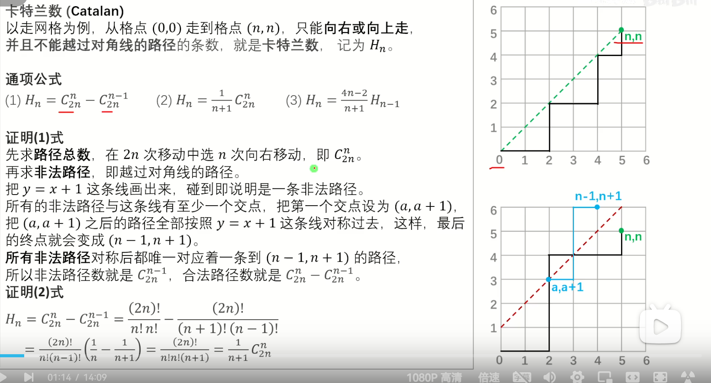

# 不定方程与同余方程组
**前置芝士**
exgcd求解不定方程 ax+by=gcd(a,b) /线性同余方程 ax≡b(mod m) 的解
**exgcd求解不定方程 ax+by=gcd(a,b)**
设
$$
ax_1+by_1=gcd(a,b)
$$

$$
bx_2+(a\%b)y_2=gcd(b,a\%b)
$$

由欧几里得定理可得
$$
gcd(a,b)=gcd(b,a\%b)
$$

于是
$$
ax_1+by_1=bx_2+(a\%b)y_2
$$

$$
ax_1+by_1=bx_2+(a-\lfloor a/b \rfloor*b)y_2
$$

整理
$$
ax_1+by_1=ay_2+b(x_2-\lfloor a/b \rfloor*y_2)
$$

于是
$$
x_1=y_2
$$

$$
y_1=x_2-\lfloor a/b \rfloor*y_2
$$
ax+by=gcd(a,b)即可通过最初的x,y求解
于是我们可以通过递归求解
```cpp
int exgcd(int a,int b,int &x,int &y)//扩展欧几里得
{
    if(b==0)
    {
        //从x=1,y=0开始向上
        x=1;y=0;
        //ax+by=gcd(a,b)->ax=0->x=1,y=0
        return a;
    }
    //先求解gcd(a,b)
    int d=exgcd(b,a%b,x,y),t=x;
    x=y;y=t-a/b*y;
    return d;
}
```

**exgcd求解线性同余方程 ax≡b(mod m) 的解**
$$
 ax \equiv b (mod \ m) 
$$

可写成
$$
ax+mk=b
$$

于是我们先求解不定方程
$$
ax+mk=gcd(a,m)
$$

若gcd(a,m)!=1则无解，否则得到解
$$
x=x_0
$$

$$
k=k_0
$$
于是我们得到原方程的解为
$$
x_1=x_0*b/gcd(a,m)
$$

$$
k_1=k_0*b/gcd(a,m)
$$
方程的任意解(对任意整数t成立)为
$$
x=x_1+mt
$$

$$
k=k_1-at
$$
求最小的正整数解
$$
x=(x_1 \ mod \ t +t) \ mod \ t
$$
其中
$$
t=m/gcd(a,m)
$$
要用exgcd求解逆元的话，需要保证gcd(a,m)=1
代入exgcd(a,m,x,y)中,对x值域变换即可
其实就是
$$
 ax \equiv 1 (mod \ m) 
$$

可写成
$$
ax+mk=gcd(a,m)=1
$$
罢了

**中国剩余定理**
求解同余方程组
$$
\begin{cases}
x \equiv a_1 (mod \ m_1)\\
x \equiv a_2 (mod \ m_2)\\
...\\
x \equiv a_k (mod \ m_k)
\end{cases}
$$
其中
$$
m_1,m_2,...,m_k两两互质
$$
过程:
求
$$
M=m_1*m_2*...*m_k
$$
对每个m_i求
$$
M_i=M/m_i
$$

$$
M_i^{-1} \equiv 1 (mod \ m_i)
$$

$$
c_i=M_i^{-1} * M_i
$$
于是
$$
x=\sum_{i=1}^{k}a_i*c_i (mod \ M)
$$

很显然的证明，对任意一个方程组：
$$
x \equiv \sum_{i=1}^{k}a_i*c_i (mod \ m_i)
$$

$$
x \equiv a_i*M_i*M_i^{-1} (mod \ m_i)
$$

$$
x \equiv a_i (mod \ m_i) * (M_i * M_i^{-1} (mod \ m_i))
$$

按定义

$$
x \equiv a_i (mod \ m_i)
$$
代码：
```cpp
int CRT()
{
    int mul=accumulate(m.begin(),m.end(),1LL,
    [](int a,int b){return a*b;}),ans=0;
    for(int i=0;i<n;i++)
    {
        int M=mul/m[i],b,y;
        exgcd(M,m[i],b,y);//求M的逆元
        ans=(ans+nums[i]*M%mul*b%mul+mul)%mul;
    }
    return (ans%mul+mul)%mul;
}
```

**扩展中国剩余定理**
求解同余方程组
$$
\begin{cases}
x \equiv a_1 (mod \ m_1)\\
x \equiv a_2 (mod \ m_2)\\
...\\
x \equiv a_k (mod \ m_k)
\end{cases}
$$
其中
$$
m_1,m_2,...,m_k不两两互质
$$
过程:
考虑合并两个同余方程
$$
\begin{cases}
x \equiv a_1 (mod \ m_1)\\
x \equiv a_2 (mod \ m_2)
\end{cases}
$$
可写成不定方程
$$
\begin{cases}
x=a_1+k_1*m_1\\
x=a_2+k_2*m_2
\end{cases}
$$
消去x
$$
a_1+k_1*m_1=a_2+k_2*m_2
$$
于是我们得到了一个不定方程
$$
k_1*m_1+-k_2*m_2=a_2-a_1
$$
可通过exgcd求解
$$
K_1*m_1+-K_2*m_2=gcd(m_1,m_2)
$$
于是
$$
k_1=\frac{a_2-a_1}{gcd(m_1,m_2)}*K_1
$$

$$
k_2=\frac{a_1-a_2}{gcd(m_1,m_2)}*K_2
$$
得到x的一个解
$$
x_0=a_1+k_1*m_1=a_1+\frac{a_2-a_1}{gcd(m_1,m_2)}*K_1*m_1
$$
窝们很显然可以构造x的通解
$$
x=x_0+t*lcm(m_1,m_2)
$$
于是进行形式转化
$$
x \equiv x_0 (mod \ lcm(m_1,m_2))
$$
于是我们得到了两个同余方程的合并
```cpp
int _exCRT()
{
    int M=m[0],ans=nums[0];
    //M：合并后的模数，ans:合并后的余数
    for(int i=1;i<n;i++)
    {
        //当前方程：
        //x≡nums[i] (mod \ m[i])
        //x≡ans (mod \ M)
        //不定方程 ax+by=gcd(a,b)
        int a=M,b=m[i];
        int c=((nums[i]-ans)%b+b)%b;
        int x,y;
        int gcd=exgcd(a,b,x,y);
        int bg=b/gcd;
        if(c%gcd!=0) return -1;//判断有无解
        x=(x%bg+bg)%bg;//对x值域变换变成正数
        x=(x*c/gcd%bg+bg)%bg;//对x值域变换
        ans+=x*M;
        M*=bg;//更新M=lcm(M,m[i])=m[i]*M/gcd(M,m[i])
        ans=(ans%M+M)%M;
    }
    return (ans%M+M)%M;
}
```

# 筛法
### 欧拉函数的定义  
$1 \sim n$ 中与 $n$ 互质的数的个数称为欧拉函数，记为 $\varphi(n)$  
**例**：$\varphi(1) = 1,\  \varphi(2) = 1,\  \varphi(3) = 2,\  \varphi(4) = 2,\  \varphi(5) = 4$  

### 欧拉函数的性质  
1. 若 $p$ 是质数，则 $\varphi(p) = p - 1$  
2. 若 $p$ 是质数，则 $\varphi(p^k) = (p - 1)p^{k-1}$  
3. **积性函数**：若 $\gcd(m,n) = 1$，则 $\varphi(mn) = \varphi(m)\varphi(n)$  

### 欧拉函数的计算公式  
由唯一分解定理 $n = \prod_{i=1}^s p_i^{\alpha_i} = p_1^{\alpha_1}p_2^{\alpha_2}\cdots p_s^{\alpha_s}$，  
$$
\begin{aligned}
\varphi(n) 
&= \prod_{i=1}^s \varphi(p_i^{\alpha_i}) \\
&= \prod_{i=1}^s p_i^{\alpha_i-1}(p_i - 1) \\
&= \prod_{i=1}^s p_i^{\alpha_i} \left(1 - \frac{1}{p_i}\right) \\
&= \left( \prod_{i=1}^s p_i^{\alpha_i} \right) \times \left( \prod_{i=1}^s \left(1 - \frac{1}{p_i}\right) \right) \\
&= n \times \prod_{i=1}^s \frac{p_i-1}{p_i} \\
&= n \times \frac{p_1-1}{p_1} \times \frac{p_2-1}{p_2} \times \cdots \times \frac{p_s-1}{p_s}
\end{aligned}
$$  
> 欧拉函数仅由 $n$ 和质因子决定，与次数无关。  
**例**：$\varphi(12) = 12 \times \dfrac{2-1}{2} \times \dfrac{3-1}{3} = 4$

## 筛法求欧拉函数

> 若 $i$ 是质数，$\varphi[i] = i - 1$。

**在线性筛中，每个合数 $m$ 都是被最小的质因子筛掉的**。  
设 $p_j$ 是 $m$ 的最小质因子，则 $m$ 通过 $m = p_j \times i$ 筛掉。

### 分两种情况计算：
1. **若 $i$ 能被 $p_j$ 整除**（即 $i \equiv 0 \pmod{p_j}$），则 $i$ 包含了 $m$ 的所有质因子：  
   $$
   \begin{aligned}
   \varphi(m) 
   &= m \times \prod_{k=1}^s \frac{p_k-1}{p_k} \\
   &= p_j \times i \times \prod_{k=1}^s \frac{p_k-1}{p_k} \\
   &= p_j \times \varphi(i)
   \end{aligned}
   $$  
   **例**：$\varphi(12) = \varphi(2 \times 6) = 2 \times \varphi(6)$

2. **若 $i$ 不能被 $p_j$ 整除**（即 $\gcd(i, p_j)=1$），则 $i$ 和 $p_j$ 互质：  
   $$
   \begin{aligned}
   \varphi(m) 
   &= \varphi(p_j \times i) \\
   &= \varphi(p_j) \times \varphi(i) \\
   &= (p_j - 1) \times \varphi(i)
   \end{aligned}
   $$  
   **例**：$\varphi(75) = \varphi(3 \times 25) = (3 - 1) \times \varphi(25)$
```cpp
vector<int> euler()
{
    vector<int> phi(n+1);
    phi[1]=1;
    vector<int> primes;
    vector<bool>v(n+1,0);
    for(int i=2;i<=n;i++)
    {
        if(!v[i])primes.push_back(i),phi[i]=i-1;
        for(int j=0;j<primes.size()&&primes[j]*i<=n;j++)
        {
            int m=primes[j]*i;
            v[m]=1;
            if(i%primes[j]==0)
            {
                phi[m]=phi[i]*primes[j];
                break;
            }
            else phi[m]=phi[i]*(primes[j]-1);
        }
    }
}
```

## 筛法求约数个数

## 问题
给定整数 $n$ ($n \leq 10^6$)，输出 $1 \sim n$ 中每个数的约数个数。

## 约数个数定理
若正整数 $n$ 有质因数分解 $n = \prod_{i=1}^s p_i^{\alpha_i}$，则约数个数为：
$$d(n) = \prod_{i=1}^s (\alpha_i + 1)$$

### 证明
- 对每个质因子 $p_i^{\alpha_i}$，其约数可取 $p_i^0, p_i^1, \cdots, p_i^{\alpha_i}$ 共 $(\alpha_i + 1)$ 种选择
- 根据乘法原理，总约数个数为各质因子选择数的乘积：
$$d(n) = (\alpha_1 + 1) \times (\alpha_2 + 1) \times \cdots \times (\alpha_s + 1)$$


**筛法求约数个数**  
记a[i]为i的最小质因子的次数，d[i]为i的约数个数。
若 \( i \) 是质数，  
\[ a[i] = 1, \quad d[i] = 2 \]  
在线性筛中，每个合数 \( m \) 都是被最小的质因子筛掉的。  
设 \( p_j \) 是 \( m \) 的最小质因子，则 \( m \) 通过 \( m = p_j \times i \) 筛掉。  

(1) 若 \( i \) 能被 \( p_j \) 整除，则 \( p_j \) 一定是 \( i \) 的最小质因子。  
\[ a[m] = a[i] + 1; \]  
\[ d[i] = (a[i] + 1) \times \cdots, \quad d[m] = (a[m] + 1) \times \cdots \]  

于是
\[ d[m] = d[i] \times \frac{a[m] + 1}{a[i] + 1} \]
(2) 若 \( i \) 不能被 \( p_j \) 整除，则 \( i \) 不包含质因子 \( p_j \)。  
\[ a[m] = 1, \quad d[m] = d[i] \times (1 + 1) \]

```cpp
//O(n)求1-n的约数个数
vector<int> d()
{
    vector<int> a(n+1),d(n+1);
    vector<int> primes;
    vector<bool>v(n+1,0);
    for(int i=2;i<=n;i++)
    {
        if(!v[i])
        {
            primes.push_back(i);
            a[i]=1,d[i]=2;
        }
        for(int j=0;j<primes.size()&&primes[j]*i<=n;j++)
        {
            int m=primes[j]*i;
            v[m]=1;
            if(i%primes[j]==0)
            {
                a[m]=a[i]+1;
                d[m]=d[i]/(a[i]+1)*(a[m]+1);
                break;
            }
            else
            {
                a[m]=1;
                d[m]=d[i]*2;
            }
        }
    }
}
```

## 约数和定理

若 \( n = \prod_{i=1}^s p_i^{\alpha_i} \)，则 \( f(n) = \prod_{i=1}^s \sum_{j=0}^{\alpha_i} p_i^j \)

**证明：**  
\( p_i^{\alpha_i} \) 的约数有 \( p_i^0, p_i^1, \cdots, p_i^{\alpha_i} \) 共 \( (\alpha_i + 1) \) 个，其约数和为 \( \sum_{j=0}^{\alpha_i} p_i^j \)。

根据乘法原理，  
\[ f(n) = \prod_{i=1}^s \sum_{j=0}^{\alpha_i} p_i^j \]

**例：**  
\[ 12 = 2^2 \times 3^1, \]  
\[ f(12) = (1 + 2 + 4) \times (1 + 3) = 7 \times 4 = 28 \]

----

## 筛法求约数和
记g[i]为i的最小质因子的幂和 1 + p^1 +p^2 + ... + p^k，f[i]为i的约数和。
若 \( i \) 是质数，  
\[ g[i] = f[i] = i + 1 \]

在线性筛中，每个合数 \( m \) 都是被最小的质因子筛掉的。设 \( p_j \) 是 \( m \) 的最小质因子，则 \( m \) 通过 \( m = i \times p_j \) 筛掉。

(1) 若 \( i \) 能被 \( p_j \) 整除，则 \( p_j \) 一定也是 \( i \) 的最小质因子  
\[ g[i] = p_j^0 + p_j^1 + \cdots + p_j^{\alpha_j}, \quad g[m] = p_j^0 + p_j^1 + \cdots + p_j^{\alpha_j+1} \]  
\[ f[i] = g[i] \times \cdots, \quad f[m] = g[m] \times \cdots \]
于是
\[ f[m] = f[i] \times \frac{g[m]}{g[i]} \]

(2) 若 \( i \) 不能被 \( p_j \) 整除，则 \( i \) 不包含质因子 \( p_j \)。  
\[ g[m] = 1 + p_j \]  
\[ f[m] = g[m] \times f[i] \]

```cpp
//O(n)求1-n的约数和
vector<int> sumd()
{
    vector<int> g(n+1),f(n+1);
    vector<int> primes;
    vector<bool>v(n+1,0);
    g[1]=f[1]=1;
    for(int i=2;i<=n;i++)
    {
        if(!v[i])
        {
            primes.push_back(i);
            f[i]=g[i]=i+1;
        }
        for(int j=0;j<primes.size()&&primes[j]*i<=n;j++)
        {
            int m=primes[j]*i;
            v[m]=1;
            if(i%primes[j]==0)
            {
                g[m]=g[i]*primes[j]+1;
                f[m]=f[i]*g[m]/g[i];
                break;
            }
            else
            {
                g[m]=primes[j]+1;
                f[m]=f[i]*g[m];
            }
        }
    }
}
```

## 唯一分解定理

\[ n = \prod_{i=1}^{s} p_i^{\alpha_i} = p_1^{\alpha_1} p_2^{\alpha_2} \cdots p_s^{\alpha_s} \]

---

## 莫比乌斯函数定义

莫比乌斯函数记作 $\mu(n)$，它是一个经典的数论函数，定义如下：

- $\mu(1) = 1$

- 如果 $n$ 含有平方因子（即存在某个质数 $p$，使得 $p^2 \mid n$），则 $\mu(n) = 0$

- 如果 $n$ 是 $k$ 个**互不相同的质数**的乘积（即 $n = p_1 p_2 \cdots p_k$），则：

$$
\mu(n) = (-1)^k
$$

---


## 筛法求莫比乌斯函数

若 \(i\) 是质数，\(\mu[i] = -1\)。  
在线性筛中，每个合数 \(m\) 都是被最小的质因子筛掉的。  
设 \(p_j\) 是 \(m\) 的最小质因子，则 \(m\) 通过 \(m = i \times p_j\) 筛掉。  

(1) 若 \(i\) 能被 \(p_j\) 整除，则 \(i\) 也包含质因子 \(p_j\)。  
\[ \mu[m] = 0 \]

(2) 若 \(i\) 不能被 \(p_j\) 整除，则 \(m\) 比 \(i\) 多一个不同的质因子 \(p_j\)  
- 若 \(\mu[i] = -1\), 则 \(\mu[m] = 1\)  
- 若 \(\mu[i] = 1\), 则 \(\mu[m] = -1\)  
- 若 \(\mu[i] = 0\), 则 \(\mu[m] = 0\)  
综上，\(\mu[m] = -\mu[i]\)。


# 线性逆元

**O(n)求阶乘和阶乘逆元**
## 📘 推导目标

给定质数 $p$，我们希望在线性时间内计算 $1$ 到 $n$ 的所有数在模 $p$ 意义下的乘法逆元，即：  
$$
\text{求 } \forall 1 \le i \le n, \quad \text{使得 } r_i \cdot i \equiv 1 \pmod{p} \text{ 的 } r_i
$$

---

## 🧮 推导公式

我们设 $r_i = i^{-1} \bmod p$，有：
- $r_1 = 1$
- 对于 $i > 1$，我们可以利用如下递推式求出 $r_i$：

\[
r_i = (p - \left\lfloor \frac{p}{i} \right\rfloor) \cdot r_{p \bmod i} \bmod p
\]

---

## ✏️ 证明过程


考虑：

$$
p = i \cdot \left\lfloor \frac{p}{i} \right\rfloor + (p \bmod i) \Rightarrow p \bmod i = p - i \cdot \left\lfloor \frac{p}{i} \right\rfloor
$$

两边模p:

$$
i \cdot \left( \left\lfloor \frac{p}{i} \right\rfloor \right) \equiv - (p \bmod i) \pmod{p}
\Rightarrow i \cdot \left( \left\lfloor \frac{p}{i} \right\rfloor \right) \cdot (p \bmod i)^{-1} \equiv -1 \pmod{p}
$$

两边都乘上 $-1$：

$$
i \cdot \left( -\left\lfloor \frac{p}{i} \right\rfloor \right) \cdot (p \bmod i)^{-1} \equiv 1 \pmod{p}
$$

于是我们得出：

$$
\boxed{
\text{inv}[i] \equiv - \left( \left\lfloor \frac{p}{i} \right\rfloor \right) \cdot \text{inv}[p \bmod i] \pmod{p}
}
$$

再化简成**无负数形式**：

$$
\boxed{
\text{inv}[i] = (p - p / i) \cdot \text{inv}[p \% i] \bmod p
}
$$

这就是我们要用的递推式！


---

## 🧪 C++ 实现示例

```cpp
void preC()
{
    inv[1]=1;
    for(int i=2;i<=n;i++)
    {
        inv[i]=(mod-mod/i)*inv[mod%i]%mod;
    }
    fac[0]=invfac[0]=1;
    for(int i=1;i<=n;i++)
    {
        fac[i]=fac[i-1]*i%mod;
        invfac[i]=invfac[i-1]*inv[i]%mod;
    }
}
```

---

## 🧠 时间复杂度

- 时间：$\mathcal{O}(n)$
- 空间：$\mathcal{O}(n)$
- 要求 $p$ 是质数（否则不存在乘法逆元）

# 和式变换
# 和式变换规则与技术

## 基本变换规则
1. **分配律**  
   \[
   \sum_{k \in K} c a_k = c \sum_{k \in K} a_k
   \]
   
2. **结合律**  
   \[
   \sum_{k \in K} (a_k + b_k) = \sum_{k \in K} a_k + \sum_{k \in K} b_k
   \]
   
3. **交换律**  
   \[
   \sum_{k \in K} a_k = \sum_{p(k) \in K} a_{p(k)}
   \]
   其中 $p(k)$ 是指标集的任意排列  
   **示例**：  
   $a_1 + a_2 + a_3 + a_6 = a_6 + a_3 + a_2 + a_1$

---

## 高级变换技术
### 1. 替换条件式
\[
\sum_{i=1}^{n} \sum_{j=1}^{m} \sum_{d|\gcd(i,j)} d = 
\sum_{i=1}^{n} \sum_{j=1}^{m} \sum_{d=1}^{\min(n,m)} [d|i][d|j] d
\]
### 2. 替换指标变量
\[
\sum_{i=1}^{n} \sum_{j=1}^{m} [\gcd(i,j) = k] = 
\sum_{i'=1}^{\lfloor n/k \rfloor} \sum_{j'=1}^{\lfloor m/k \rfloor} [\gcd(i',j') = 1]
\]
其中 $i' = i/k, j' = j/k$

### 3. 交换求和次序
\[
\sum_{i=1}^{n} \sum_{j=1}^{m} A(i)B(j) = 
\sum_{j=1}^{m} \sum_{i=1}^{n} A(i)B(j)
\]

### 4. 分离变量
\[
\sum_{i=1}^{n} \sum_{j=1}^{m} A(i)B(j) = 
\left( \sum_{i=1}^{n} A(i) \right) \left( \sum_{j=1}^{m} B(j) \right)
\]

## 技巧
### 1. 区间整除条件式的封闭形式
\[
\sum_{i=1}^{n} [k|i]=\lfloor \frac{n}{k} \rfloor
\]
扩展
\[
\lfloor \frac{\lfloor \frac{n}{k} \rfloor}{m} \rfloor=\lfloor \frac{n}{km} \rfloor
\]
>人话：在1到n的整数中，能被k整除的数的个数是 $\lfloor \frac{n}{k} \rfloor$

### 2. $[gcd(i,j)=1]$的进一步变换
\[
\sum_{i=1}^{n} \sum_{j=1}^{m} [\gcd(i,j)=1] = \sum_{i=1}^{n} \sum_{j=1}^{m} \sum_{d|\gcd(i,j)} \mu(d)
\]
\[
   = \sum_{i=1}^{n} \sum_{j=1}^{m} \sum_{d=1}^{\min(n,m)} \mu(d) [d|i][d|j]
\]
>人话：变换枚举顺序，d能整除i和j，则d能整除gcd(i,j)

### 3. 有序对和无序对求和的互相转换
\[
\sum_{i=1}^{n} \sum_{j=1}^{n} A(i,j) = 2*\sum_{i=1}^{n} \sum_{j=i}^{n} A(i,j) - \sum_{i=1}^{n} A(i,i)
\]
当且仅当 $A(i,j) = A(j,i)$ 时成立
>人话：将有序对转换为无序对，注意枚举顺序
### 4. 通过$gcd(i,j)=1$构造条件式$[gcd(i,j)=1]$
令
\[
   d=\gcd(i,j),i=i'd, j=j'd
\]
注意，当且仅当
\[
   \gcd(i',j')=1
\]
时，此变换成立，于是
\[
\sum_{i=1}^{n} \sum_{j=1}^{m} f(\gcd(i,j)) 
\]
\[
= \sum_{d=1}^{\min(n,m)} \sum_{i'd=1}^{n} \sum_{j'd=1}^{m} f(d) [\gcd(i',j')=1]
\]
\[
= \sum_{d=1}^{\min(n,m)} \sum_{i'=1}^{\lfloor n/d \rfloor} \sum_{j'=1}^{\lfloor m/d \rfloor} f(d) [\gcd(i',j')=1]
\]
变量换名
\[
= \sum_{d=1}^{\min(n,m)} \sum_{i=1}^{\lfloor n/d \rfloor} \sum_{j=1}^{\lfloor m/d \rfloor} f(d) [\gcd(i,j)=1]
\]
>人话：没有人话


# 生成函数

序列 $a$ 的普通生成函数（ordinary generating function，OGF）定义为形式幂级数（其实就是一个多项式()）：

$$
F(x)=\sum_{n}a_n x^n
$$

$a$ 既可以是有穷序列，也可以是无穷序列。常见的例子（假设 $a$ 以 $0$ 为起点）：

1.  序列 $a=\langle 1,2,3\rangle$ 的普通生成函数是 $1+2x+3x^2$。
2.  序列 $a=\langle 1,1,1,\cdots\rangle$ 的普通生成函数是 $\sum_{n\ge 0}x^n$。
3.  序列 $a=\langle 1,2,4,8,16,\cdots\rangle$ 的生成函数是 $\sum_{n\ge 0}2^nx^n$。
4.  序列 $a=\langle 1,3,5,7,9,\cdots\rangle$ 的生成函数是 $\sum_{n\ge 0}(2n+1)x^n$。

换句话说，如果序列 $a$ 有通项公式，那么它的普通生成函数的系数就是通项公式。

## 基本运算

考虑两个序列 $a,b$ 的普通生成函数，分别为 $F(x),G(x)$。那么有

$$
F(x)\pm G(x)=\sum_n (a_n\pm b_n)x^n
$$

因此 $F(x)\pm G(x)$ 是序列 $\langle a_n\pm b_n\rangle$ 的普通生成函数。

考虑乘法运算，也就是卷积：

$$
F(x)G(x)=\sum_n x^n \sum_{i=0}^na_ib_{n-i}
$$

因此 $F(x)G(x)$ 是序列 $\langle \sum_{i=0}^n a_ib_{n-i} \rangle$ 的普通生成函数。

## 封闭形式

在运用生成函数的过程中，我们不会一直使用形式幂级数的形式，而会适时地转化为封闭形式以更好地化简。

例如 $\langle 1,1,1,\cdots\rangle$ 的普通生成函数 $F(x)=\sum_{n\ge 0}x^n$，我们可以发现

$$
F(x)x+1=F(x)
$$

那么解这个方程得到

$$
F(x)=\frac{1}{1-x}
$$

这就是 $\sum_{n\ge 0}x^n$ 的封闭形式。

考虑等比数列 $\langle 1,p,p^2,p^3,p^4,\cdots\rangle$ 的生成函数 $F(x)=\sum_{n\ge 0}p^nx^n$，有

$$
\begin{aligned}F(x)px+1 &=F(x)\\F(x) &=\frac{1}{1-px}\end{aligned}
$$

等比数列的封闭形式与展开形式是常用的变换手段。


## 应用

接下来给出一些例题，来介绍生成函数在 OI 中的具体应用。

##### 普通生成函数可以用来解决**多重集合组合数**问题。

---

 问题：有 $n$ 种物品，每种物品有 $a_i$ 个，问取 $m$ 个物品的组合数？

---

### 多重集合组合数

设从每种物品中取 $b_i$ 个，$0 \le b_i \le a_i$，  
$m = \sum_{i=1}^{n} b_i$，对于一组选定的 $b_i$ 进行组合的方案数为 **1**。  
例如，取 3 个 A，1 个 B 的方案就是 {AAAB}；取 2 个 A、2 个 B 的方案就是 {AABB}。  
那么，所有满足  
_**b₁ + b₂ + ⋯ + bₙ = m**_ 的方案之和，即答案。

---

### 构造普通生成函数

第 1 种物品的生成函数为 $(1 + x^1 + x^2 + ⋯ + x^{a_1})$，  
第 $n$ 种物品的生成函数为 $(1 + x^1 + x^2 + ⋯ + x^{a_n})$。  

即  
$$(1 + x^1 + x^2 + ⋯ + x^{a_1})(1 + x^1 + x^2 + ⋯ + x^{a_2}) ⋯ (1 + x^1 + x^2 + ⋯ + x^{a_n})$$  
求 $x^m$ 的系数。

> **注意：** 指数即物品个数，系数即组合数。

---

### 例如：

有三种物品，分别有 3、2、1 个，问取 4 个物品的组合数？  
枚举的话，有 {AAAB, AAAC, AABB, AABC, ABBC}，5 个方案。

构造  
$$(1 + x + x^2 + x^3)(1 + x + x^2)(1 + x)$$  

逐步展开：

```math
= (1 + x + x^2 + x^3)(1 + x + x^2)(1 + x) \\
= (1 + x + x^2 + x^3 + x^2 + x^3 + x^4 + x^3 + x^4 + x^5)(1 + x) \\
= (1 + 2x + 3x^2 + 3x^3 + 3x^4 + 2x^5 + x^6)(1 + x) \\
= 1 + 3x + 5x^2 + 6x^3 + 5x^4 + 3x^5 + x^6
```

$x^4$ 的系数为 5，即答案。

### HDU - 1085 Holding Bin-Laden Captive!

面值为 1, 2, 5 的硬币分别有 $a_1, a_2, a_3$ 枚，  
问用这些硬币**不能**组成的最小面值是多少？

---

### 思路

构造生成函数：

$$(1 + x^1 + x^2 + \cdots + x^{a_1}) \times (1 + x^2 + x^4 + \cdots + x^{2a_2}) \times (1 + x^5 + x^{10} + \cdots + x^{5a_3})$$

从小到大遍历系数，**为 0 的那一项**就是答案。

---

### 例如：

1 分有 1 枚，2 分有 1 枚，5 分有 1 枚：

```math
(1 + x^1)(1 + x^2)(1 + x^5) \\
= (1 + x^2 + x^1 + x^3)(1 + x^5) \\
= (1 + x^1 + x^2 + x^3)(1 + x^5) \\
= (1 + x^5 + x^1 + x^6 + x^2 + x^7 + x^3 + x^8) \\
= 1 + x^1 + x^2 + x^3 + x^5 + x^6 + x^7 + x^8
```

最小不能组成的面值是 4。

### 食物
    在许多不同种类的食物中选出 $n$ 个，每种食物的限制如下：
    
    1.  承德汉堡：偶数个
    2.  可乐：0 个或 1 个
    3.  鸡腿：0 个，1 个或 2 个
    4.  蜜桃多：奇数个
    5.  鸡块：4 的倍数个
    6.  包子：0 个，1 个，2 个或 3 个
    7.  土豆片炒肉：不超过一个。
    8.  面包：3 的倍数个
    
    每种食物都是以「个」为单位，只要总数加起来是 n 就算一种方案。对于给出的 n 你需要计算出方案数，对 10007 取模。

这是一道经典的生成函数题。对于一种食物，我们可以设 $a_n$ 表示这种食物选 $n$ 个的方案数，并求出它的生成函数。而两种食物一共选 $n$ 个的方案数的生成函数，就是它们生成函数的卷积。多种食物选 $n$ 个的方案数的生成函数也是它们生成函数的卷积。

在理解了方案数可以用卷积表示以后，我们就可以构造生成函数（标号对应题目中食物的标号）：

1.  $\displaystyle\sum_{n\ge 0}x^{2n}=\dfrac{1}{1-x^2}$。
2.  $1+x$。
3.  $1+x+x^2=\dfrac{1-x^3}{1-x}$。
4.  $\displaystyle\sum_{n\ge 0}x^{2n+1}=\displaystyle\sum_{n\ge 0}x^{n}-\displaystyle\sum_{n\ge 0}x^{2n}=\dfrac{x}{1-x^2}$。
5.  $\displaystyle \sum_{n\ge 0}x^{4n}=\dfrac{1}{1-x^4}$。
6.  $1+x+x^2+x^3=\dfrac{1-x^4}{1-x}$。
7.  $1+x$。
8.  $\displaystyle\sum_{n\ge 0}x^{3n}=\dfrac{1}{1-x^3}$。

那么全部乘起来，得到答案的生成函数：

$$
F(x)=\frac{(1+x)(1-x^3)x(1-x^4)(1+x)}{(1-x^2)(1-x)(1-x^2)(1-x^4)(1-x)(1-x^3)}
=\frac{x}{(1-x)^4}
$$

**广义二项式定理**
\[
\frac{1}{(1-x)^n} = \sum_{i=0}^\infty C_{n+i-1}^i x^i
\]

然后将它转化为展开形式（使用广义二项式定理）：


$$
\begin{aligned}
F(x) &= x \sum_{i=0}^{\infty} \left( C_{4+i-1}^{i} \right) x^i \\
&= \sum_{i=0}^{\infty} \left( C_{4+i-1}^{i} \right) x^{i+1} \\
&= \sum_{k=1}^{\infty} \left( C_{k+2}^{k-1}\right) x^k \\
&= \sum_{k=1}^{\infty} \left( C_{k+2}^{3}\right) x^k
\end{aligned}
$$

因此答案为 

$$
 C_{n+2}^{3}
$$

## 指数生成函数
指数生成函数：

\[ F(x) = \sum_{n\geq 0} a_n \frac{x^n}{n!} \]


序列 \( <1,1,1,\cdots> \) 的指数生成函数是 
\[ 1 + \frac{x}{1!} + \frac{x^2}{2!} + \frac{x^3}{3!} + \cdots = \sum_{n\geq 0} \frac{x^n}{n!} = e^{x} \]

序列 \( <1,p,p^2,\cdots> \) 的指数生成函数是 
\[ 1 + p \frac{x}{1!} + p^2 \frac{x^2}{2!} + p^3 \frac{x^3}{3!} + \cdots = \sum_{n\geq 0} p^n \frac{x^n}{n!} = e^{px} \]

### 基本运算

加减运算

\[F(x) \pm G(x) = \sum_{i\geq 0} a_i \frac{x^i}{i!} \pm \sum_{j\geq 0} b_j \frac{x^j}{j!} = \sum_{n\geq 0} (a_n \pm b_n) \frac{x^n}{n!}\]

因此 \( F(x) \pm G(x) \) 是序列 \( <a_n \pm b_n> \) 的指数生成函数。

乘法运算（卷积）

\[F(x)G(x) = \sum_{i\geq 0} a_i \frac{x^i}{i!} \sum_{j\geq 0} b_j \frac{x^j}{j!} = \sum_{n\geq 0} x^n \sum_{i=0}^n a_i b_{n-i} \frac{1}{i!(n-i)!} = \sum_{n\geq 0} \frac{x^n}{n!} \sum_{i=0}^n \frac{n!}{i!(n-i)!} a_i b_{n-i} = \sum_{n\geq 0} \frac{x^n}{n!} \sum_{i=0}^n C_n^i a_i b_{n-i}\]

因此 \( F(x)G(x) \) 是序列 \( <\sum_{i=0}^n C_n^i a_i b_{n-i}> \) 的指数生成函数。

### 封闭形式

我们同样考虑指数生成函数的封闭形式。

序列 $\langle 1,1,1,\cdots\rangle$ 的指数生成函数是：

$$
\hat{F}(x) = \sum_{n \ge 0}\frac{x^n}{n!} = \mathrm{e}^x
$$

因为你将 $\mathrm{e}^x$ 在 $x = 0$ 处泰勒展开就得到了它的无穷级数形式。

类似地，等比数列 $\langle 1,p,p^2,\cdots\rangle$ 的指数生成函数是：

$$
\hat{F}(x) = \sum_{n\ge 0}\frac{p^nx^n}{n!}=\mathrm{e}^{px}
$$

### 指数生成函数可以用来解决多重集排列数问题。

HDU - 1521 排列组合
题意：有 \( n \) 种物品，每种物品有 \( a_i \) 个，问取 \( m \) 个物品的排列数？

多重集排列数
设从每种物品中取 \( b_i \) 个，\( 0 \leq b_i \leq a_i \)，\( m = \sum_{i=1}^n b_i \)，对于一组选定的 \( b_i \) 进行排列的方案数为 \(\frac{m!}{b_1!b_2!\cdots b_n!}\)。若 \( m \) 个物品互不相同，其排列数为 \( m! \)，分母就是对每种相同物品的排列数去重。
例如，取3个A、1个B的排列数为 \(\frac{4!}{3!1!} = \frac{24}{6} = 4\)，即 {AAAA, AABA, ABAA, BAAA}。

取2个A、2个B的排列数为 \(\frac{4!}{2!2!} = \frac{24}{4} = 6\)，即 {AABB, ABAB, ABBA, BAAB. BABA, BBAA}。
那么，所有满足 \( b_1 + b_2 + \cdots + b_n = m \) 的排列数之和，即答案。

构造指数生成函数
第1种物品的生成函数为 \((1 + \frac{x^1}{1!} + \frac{x^2}{2!} + \cdots + \frac{x^{a_1}}{a_1!})\)，第n种物品的生成函数为 \((1 + \frac{x^1}{1!} + \frac{x^2}{2!} + \cdots + \frac{x^{a_n}}{a_n!})\)。
即 \((1 + \frac{x^1}{1!} + \frac{x^2}{2!} + \cdots + \frac{x^{a_1}}{a_1!})(1 + \frac{x^1}{1!} + \frac{x^2}{2!} + \cdots + \frac{x^{a_2}}{a_2!})\cdots(1 + \frac{x^1}{1!} + \frac{x^2}{2!} + \cdots + \frac{x^{a_n}}{a_n!})\)，求 \(\frac{x^m}{m!}\) 的系数。

做乘法，\(\frac{x^{b_1}}{b_1!} \times \frac{x^{b_2}}{b_2!} \times \cdots \times \frac{x^{b_n}}{b_n!} = \frac{x^{b_1+b_2+\cdots+b_n}}{b_1!b_2!\cdots b_n!} = \frac{x^m}{b_1!b_2!\cdots b_n!} = \frac{m!}{b_1!b_2!\cdots b_n!} \cdot \frac{x^m}{m!}\)。
做卷积，所有满足 \( b_1 + b_2 + \cdots + b_n = m \) 的项的系数之和，再乘以 \( m! \)，即答案。

## 一点小结论（前已述及）

(1) 序列 \( a \) 的普通生成函数：\( F(x) = \sum a_n x^n \)

(2) 序列 \( a \) 的指数生成函数：\( F(x) = \sum a_n \frac{x^n}{n!} \)

---

**泰勒展开式**

普通生成函数：
\[
\frac{1}{1-x} = 1 + x + x^2 + x^3 + \cdots = \sum_{n=0}^\infty x^n
\]
\[
\frac{1}{1-x^2} = 1 + x^2 + x^4 + \cdots
\]
\[
\frac{1}{1-x^3} = 1 + x^3 + x^6 + \cdots
\]
\[
\frac{1}{(1-x)^2} = 1 + 2x + 3x^2 + \cdots
\]

指数生成函数：
\[
e^x = 1 + \frac{x^1}{1!} + \frac{x^2}{2!} + \frac{x^3}{3!} + \cdots = \sum_{n=0}^\infty \frac{x^n}{n!}
\]
\[
e^{-x} = 1 - \frac{x^1}{1!} + \frac{x^2}{2!} - \frac{x^3}{3!} + \cdots
\]
\[
\frac{e^{x} + e^{-x}}{2} = 1 + \frac{x^2}{2!} + \frac{x^4}{4!} + \cdots
\]
\[
\frac{e^{x} - e^{-x}}{2} = x + \frac{x^3}{3!} + \frac{x^5}{5!} + \cdots
\]

---

**有穷序列的生成函数**
\[
1 + x + x^2 = \frac{1-x^3}{1-x}
\]
\[
1 + x + x^2 + x^3 = \frac{1-x^4}{1-x}
\]

---

**广义二项式定理**
\[
\frac{1}{(1-x)^n} = \sum_{i=0}^\infty C_{n+i-1}^i x^i
\]

**证明：**

二项式定理：
\[
(1+x)^n = \sum_{i=0}^n C_n^i x^i
\]

(1) 扩展域：
\[
(1+x)^n = \sum_{i=0}^\infty C_n^i x^i, \quad \text{当 } i > n \text{ 时 } C_n^i = 0
\]

(2) 扩展指数为负数：
\[
C_{-n}^i = (-n)(-n-1)\cdots(-n-i+1)
\]
\[
= (-1)^i \cdot \frac{n(n+1)\cdots(n+i-1)}{i!} = (-1)^i C_{n+i-1}^i
\]
\[
(1+x)^{-n} = \sum_{i=0}^\infty C_{-n}^i x^i
\]
\[
= \sum_{i=0}^\infty (-1)^i C_{n+i-1}^i x^i
\]

(3) 括号内的加号变减号：
\[
(1-x)^{-n} = \sum_{i=0}^\infty (-1)^i C_{n+i-1}^i (-x)^i
\]
\[
= \sum_{i=0}^\infty C_{n+i-1}^i x^i
\]

证毕。

# 莫反

### 狄利克雷生成函数

数列 $\langle a_1, a_2, a_3, \cdots \rangle$ 的狄利克雷生成函数定义为：
$$
F(x) = \frac{a_1}{1^x} + \frac{a_2}{2^x} + \frac{a_3}{3^x} + \cdots = \sum_{n=1}^{\infty} \frac{a_n}{n^x}
$$

---

#### 乘法运算（Dirichlet 卷积）
$$
\begin{aligned}
\sum_{i=1}^{\infty} \frac{a_i}{i^x} \sum_{j=1}^{\infty} \frac{b_j}{j^x}
&= \left( \frac{a_1}{1^x} + \frac{a_2}{2^x} + \frac{a_3}{3^x} + \frac{a_4}{4^x} + \cdots \right) \left( \frac{b_1}{1^x} + \frac{b_2}{2^x} + \frac{b_3}{3^x} + \frac{b_4}{4^x} + \cdots \right) \\
&= \frac{a_1 b_1}{1^x} + \frac{a_1 b_2}{2^x} + \frac{a_2 b_1}{3^x} + \frac{a_1 b_3}{4^x} + \cdots \\
&= \sum_{n=1}^{\infty} \frac{1}{n^x} \sum_{d|n} a_d b_\frac{n}{d}
\end{aligned}
$$

#### 系数计算规则
$\frac{1}{n^x}$ 项的系数等于所有满足 $d|n$（$d$ 整除 $n$）的项 $a_d b_{n/d}$ 之和：
- **$4^x$ 的系数**：$a_1 b_4 + a_2 b_2 + a_4 b_1$  
  （枚举 4 的约数 $d=1,2,4$）
- **$6^x$ 的系数**：$a_1 b_6 + a_2 b_3 + a_3 b_2 + a_6 b_1$  
  （枚举 6 的约数 $d=1,2,3,6$）

### 一点和式的小结论

# 欧拉函数

## 1. 定义
欧拉函数 $\varphi(n)$ 表示小于等于 $n$ 且与 $n$ 互质的正整数个数：
$$
\varphi(n) = \sum_{i=1}^n [\gcd(i,n) = 1]
$$

### 欧拉函数值表
| $n$   | 1 | 2 | 3 | 4 | 5 | 6 | 7 | 8 | 9 | 10 | 11 | 12 |
|-------|---|---|---|---|---|---|---|---|---|---|----|----|
| $\varphi(n)$ | 1 | 1 | 2 | 2 | 4 | 2 | 6 | 4 | 6 | 4  | 10 | 4  |

## 2. 性质
### 欧拉函数求和定理
对于任意正整数 $n$，其所有因子的欧拉函数值之和等于 $n$：
$$
\sum_{d|n} \varphi(d) = n
$$

### 验证示例
$$
\begin{aligned}
\varphi(1) &= 1 \\
\varphi(1) + \varphi(2) &= 1 + 1 = 2 \\
\varphi(1) + \varphi(3) &= 1 + 2 = 3 \\
\varphi(1) + \varphi(2) + \varphi(4) &= 1 + 1 + 2 = 4 \\
\varphi(1) + \varphi(5) &= 1 + 4 = 5 \\
\varphi(1) + \varphi(2) + \varphi(3) + \varphi(6) &= 1 + 1 + 2 + 2 = 6
\end{aligned}
$$


## 证明思路
考虑以 $n$ 为分母的真分数 $\left[0,1\right)$ 区间：
$$
\frac{0}{n}, \frac{1}{n}, \frac{2}{n}, \cdots, \frac{n-1}{n}
$$
将这些分数化简为最简形式后，根据分母分组，可证明结论。

---

## 示例演示（$n=12$）
### 所有真分数
$$
\frac{0}{12}, \frac{1}{12}, \frac{2}{12}, \frac{3}{12}, \frac{4}{12}, \frac{5}{12}, \frac{6}{12}, \frac{7}{12}, \frac{8}{12}, \frac{9}{12}, \frac{10}{12}, \frac{11}{12}
$$

### 化简后分组
| 分母 $d$ | 最简分数                                                                 | 个数 $\varphi(d)$ |
|---------|--------------------------------------------------------------------------|------------------|
| 1       | $\dfrac{0}{1}$                                                           | $\varphi(1)=1$  |
| 2       | $\dfrac{1}{2}$                                                           | $\varphi(2)=1$  |
| 3       | $\dfrac{1}{3},\dfrac{2}{3}$                                              | $\varphi(3)=2$  |
| 4       | $\dfrac{1}{4},\dfrac{3}{4}$                                              | $\varphi(4)=2$  |
| 6       | $\dfrac{1}{6},\dfrac{5}{6}$                                              | $\varphi(6)=2$  |
| 12      | $\dfrac{1}{12},\dfrac{5}{12},\dfrac{7}{12},\dfrac{11}{12}$               | $\varphi(12)=4$ |

### 验证等式
$$
\sum_{d|12}\varphi(d) = \varphi(1)+\varphi(2)+\varphi(3)+\varphi(4)+\varphi(6)+\varphi(12) = 1+1+2+2+2+4=12
$$

---
注意到窝们的证明思路天然满足定义

## 一般性证明
1. 考虑所有分母为 $n$ 的真分数：
   $$
   \frac{k}{n} \quad (0 \leq k < n)
   $$
   共有 $n$ 个分数。

2. 将每个分数化简为最简形式 $\dfrac{a}{d}$，其中 $d \mid n$ 且 $\gcd(a,d)=1$。

3. 对 $n$ 的每个约数 $d$ 分组：
   - 分母为 $d$ 的分数个数 = $\varphi(d)$
   - 因为分子 $a$ 需满足 $1 \leq a \leq d$ 且 $\gcd(a,d)=1$

4. 总和为：
   $$
   \sum_{d|n} \varphi(d) = n
   $$
   即得证。

# 莫比乌斯函数

## 1. 定义
莫比乌斯函数 $\mu(n)$ 定义如下：
$$
\mu(n) = 
\begin{cases} 
1 & \text{若 } n = 1 \\ 
(-1)^s & \text{若 } n = p_1p_2 \cdots p_s \text{（无平方因子的整数）} \\ 
0 & \text{若 } n \text{ 包含平方因子}
\end{cases}
$$

### 莫比乌斯函数值表
| $n$   | 1 | 2 | 3 | 4 | 5 | 6 | 7 | 8 | 9 | 10 | 11 | 12 |
|-------|---|---|---|---|---|---|---|---|---|---|----|----|
| $\mu(n)$ | 1 | -1 | -1 | 0 | -1 | 1 | -1 | 0 | 0 | 1  | -1 | 0  |

---

## 2. 核心性质
$$
\sum_{d|n} \mu(d) = [n = 1] = 
\begin{cases} 
1 & n=1 \\
0 & n>1 
\end{cases}
$$

### 验证示例
$$
\begin{aligned}
n=1:&\quad \mu(1) = 1 \\
n=2:&\quad \mu(1) + \mu(2) = 1 + (-1) = 0 \\
n=3:&\quad \mu(1) + \mu(3) = 1 + (-1) = 0 \\
n=4:&\quad \mu(1) + \mu(2) + \mu(4) = 1 + (-1) + 0 = 0 \\
n=6:&\quad \mu(1) + \mu(2) + \mu(3) + \mu(6) = 1 + (-1) + (-1) + 1 = 0
\end{aligned}
$$

---

## 3. 证明（$n>1$ 时和为 0）

### 证明思路
设 $n = p_1^{a_1}p_2^{a_2} \cdots p_s^{a_s}$，定义 $n'$ 为 $n$ 的平方自由部分：
$$
n' = p_1p_2 \cdots p_s
$$
则：
$$
\sum_{d|n} \mu(d) = \sum_{d|n'} \mu(d)
$$

### 组合证明
考虑 $n$ 的质因子集合 $S$，其大小为 $s$：
- $\mu(d) \neq 0$ 的 $d$ 对应 $S$ 的子集
- $d$ 的质因子个数为 $k$ 时，$\mu(d) = (-1)^k$
- 由二项式定理

$$
\sum_{d|n'} \mu(d) = \sum_{k=0}^s (-1)^k \binom{s}{k} = (1+(-1))^s = 0
$$

### 示例说明（$n=6$）
$6 = 2^1 \times 3^1$，$S = \{2,3\}$：
$$
\begin{aligned}
\mu(1) &= (-1)^0 = 1 \quad & (\text{取 0 个质因子}) \\
\mu(2) &= (-1)^1 = -1 \quad & (\text{取质因子 }2) \\
\mu(3) &= (-1)^1 = -1 \quad & (\text{取质因子 }3) \\
\mu(6) &= (-1)^2 = 1 \quad & (\text{取质因子 }2,3)
\end{aligned}
$$
和为 $1 + (-1) + (-1) + 1 = 0$。


# 狄利克雷卷积

## 定义
设 $f(n)$, $g(n)$ 是两个积性函数，其狄利克雷卷积定义为：
$$
(f * g)(n) = \sum_{d|n} f(d)g\left(\frac{n}{d}\right) = \sum_{d|n} f\left(\frac{n}{d}\right)g(d)
$$

>注意跟狄利克雷生成函数形式上的相似性
>读作：$f$ 卷 $g$ 

### 示例
$$
(f * g)(4) = f(1)g(4) + f(2)g(2) + f(4)g(1)
$$

---

## 运算规律
1. **交换律**：$f * g = g * f$  
2. **结合律**：$(f * g) * h = f * (g * h)$  
3. **分配律**：$(f + g) * h = f * h + g * h$  

---

## 常用函数
| 函数名称 | 符号表示 | 定义 |
|---------|----------|------|
| 元函数 | $\epsilon(n)$ | $[n=1] = \begin{cases} 1 & n=1 \\ 0 & n>1 \end{cases}$ |
| 常数函数 | $1(n)$ | $1$ |
| 恒等函数 | $id(n)$ | $n$ |
| 欧拉函数 | $\varphi(n)$ |  <n且与n互质的数的个数 |
| 莫比乌斯函数 | $\mu(n)$ |  $\begin{cases} 1 & n=1 \\ (-1)^k & n=p_1p_2...p_k \\ 0 & n含平方因子 \end{cases}$ |

---

>注意符号的读法 $\mu$ 读作“缪”，$\varphi$ 读作“phi”，$\epsilon$ 读作“一穆西隆”

## 常用卷积关系

简记形式
1. $\sum_{d|n} \mu(d) = [n = 1] \quad \Leftrightarrow \quad \mu * 1 = \epsilon$  
2. $\sum_{d|n} \varphi(d) = n \quad \Leftrightarrow \quad \varphi * 1 = id$  
3. $\sum_{d|n} \mu(d) \frac{n}{d} = \varphi(n) \quad \Leftrightarrow \quad \mu * id = \varphi$  
4. $f * \epsilon = f$  
5. $f * 1 \neq f$

---

>注意莫比乌斯函数是常数函数的逆元

## 证明
### 1. $\mu * 1 = \epsilon$
$$
(\mu * 1)(n) = \sum_{d|n} \mu(d) \cdot 1\left(\frac{n}{d}\right) = \sum_{d|n} \mu(d) = [n = 1] = \epsilon(n)
$$

### 2. $\varphi * 1 = id$
$$
(\varphi * 1)(n) = \sum_{d|n} \varphi(d) \cdot 1\left(\frac{n}{d}\right) = \sum_{d|n} \varphi(d) = n = id(n)
$$

### 3. $\mu * id = \varphi$
$$
(\mu * id)(n) = \sum_{d|n} \mu(d) \cdot id\left(\frac{n}{d}\right) = \sum_{d|n} \mu(d) \cdot \frac{n}{d} = \varphi(n)
$$

$$
\mu * id =\mu *\varphi *1 =(\varphi *1 * \mu) = \epsilon * \mu = \varphi
$$

### 4. $f * \epsilon = f$
$$
(f * \epsilon)(n) = \sum_{d|n} f(d) \cdot \epsilon\left(\frac{n}{d}\right) = \sum_{d|n} f(d) \cdot \left[\frac{n}{d} = 1\right] = f(n)
$$

### 5. $f * 1 \neq f$
$$
(f * 1)(n) = \sum_{d|n} f(d) \cdot 1\left(\frac{n}{d}\right) = \sum_{d|n} f(d) \neq f(n)
$$

# 莫比乌斯反演

其实就是一下几个式子(条件式变成和式)
$$
\sum_{d|n} \varphi(d) = n
$$

$$
\sum_{d|n} \mu(d) = [n = 1] = 
\begin{cases} 
1 & n=1 \\
0 & n>1 
\end{cases}
$$

把$n$换成$gcd(a,b)$


$$
\sum_{d|gcd(a,b)} \mu(d) = [gcd(a,b) = 1]
\begin{cases} 
1 & gcd(a,b)=1 \\
0 & gcd(a,b)>1 
\end{cases}
$$


# 莫比乌斯变换

## 基本公式
设 $f(n)$, $g(n)$ 均为积性函数，则：
$$
f(n) = \sum_{d|n} g(d) \iff g(n) = \sum_{d|n} \mu(d) f\left(\frac{n}{d}\right)
$$

即
$$
f=g * 1 \iff g = \mu * f
$$

- $f(n)$ 称为 $g(n)$ 的莫比乌斯变换
- $g(n)$ 称为 $f(n)$ 的莫比乌斯逆变换

---

>注意对于一些函数 f(n)，如果很难直接求出它的值，而容易求出其倍数和或约数和 g(n)，那么可以通过莫比乌斯反演简化运算，求得 
f(n) 的值。

## 证明方法一（卷积形式）
### 正向推导
$$
\begin{aligned}
f &= g * 1 \\
\mu * f &= \mu * (g * 1) \\
&= g * (\mu * 1) \\
&= g * \epsilon \\
&= g
\end{aligned}
$$

### 逆向推导
$$
\begin{aligned}
g &= \mu * f \\
g * 1 &= (\mu * f) * 1 \\
&= f * (\mu * 1) \\
&= f * \epsilon \\
&= f
\end{aligned}
$$

---

## 证明方法二（双重求和）
$$
\begin{aligned}
\sum_{d|n} \mu(d) f\left(\frac{n}{d}\right) 
&= \sum_{d|n} \mu(d) \sum_{k|\frac{n}{d}} g(k) \\
&= \sum_{d|n} \sum_{k|\frac{n}{d}} \mu(d) g(k) \\
&= \sum_{k|n} \sum_{d|\frac{n}{k}} \mu(d) g(k) \\
&= \sum_{k|n} g(k) \left( \sum_{d|\frac{n}{k}} \mu(d) \right) \\
&= \sum_{k|n} g(k) \cdot \epsilon\left(\frac{n}{k}\right) \\
&= g(n)
\end{aligned}
$$

# 排列组合
## 圆排列

\( n \) 个不同元素围成一圈的**圆排列数**，记作 \( Q_n^n \)。

考虑其中已经排好的一圈，从不同位置断开，会变成 \( n \) 个不同的线排列：  
\[ Q_n^n \times n = A_n^n \]  
则  
\[ Q_n^n = \frac{A_n^n}{n} = (n-1)! \]

例如，3 个不同元素的圆排列数为 \((3-1)! = 2\) 种：

从 \( n \) 个不同元素中选 \( m \) 个围成一圈的**圆排列数**，记作 \( Q_n^m \)：  
\[ 
    Q_n^m = C_n^m \cdot Q_m^m = \frac{n!}{m \cdot (n-m)!}
\]
>其实就是全排列固定了一个数

## 错位排列

错位排列是没有任何元素出现在其有序位置的排列。对于 \(1 \sim n\) 的排列 \(P\)，如果满足 \(P_i \neq i\)，则称 \(P\) 是 \(n\) 的错位排列。

### 错位排列数
- \(D_1 = 0\)
- \(D_2 = 1\)（即 \(\{2,1\}\)）
- \(D_3 = 2\)（即 \(\{2,3,1\},\{3,1,2\}\)）
- \(D_4 = 9\)（即 \(\{2,1,4,3\},\{2,3,4,1\},\{2,4,1,3\},\{3,1,4,2\},\{3,4,1,2\},\{3,4,2,1\},\{4,1,2,3\},\{4,3,1,2\},\{4,3,2,1\}\)）

---

### 递推关系 \(D_n = (n-1)(D_{n-1} + D_{n-2})\)
**边界条件**：
\[
D_1 = 0, \quad D_2 = 1
\]

| \(n\) | 1 | 2 | 3 | 4 | 5 | 6 | 7 | 8 |
|-------|---|---|---|---|---|---|---|---|
| \(D_n\) | 0 | 1 | 2 | 9 | 44 | 265 | 1854 | 14833 |

---

### 信封问题
\(n\) 封不同的信（编号 \(1,2,\dots,n\)）放入 \(n\) 个编号对应的信封中，要求每个信封的编号与信的编号都不相同。有多少种放置方法？

### 递推关系分析
考虑第 \(n\) 封信的放置：
1. **情况1**：前 \(n-1\) 封信已全错排  
   - 第 \(n\) 封信只需与前面任一封信交换位置  
   - 方法数：\((n-1) \cdot D_{n-1}\)

2. **情况2**：前 \(n-1\) 封信恰好有 1 封位置正确  
   - 第 \(n\) 封信必须与位置正确的信交换  
   - 方法数：\((n-1) \cdot D_{n-2}\)

> 其他情况无法通过一次交换变成全错排

## 第一类斯特林数（斯特林轮换数）

将 \( n \) 个不同元素划分为 \( m \) 个非空圆排列的方案数，  
记作 \( S(n, m) \) 或：
\[
\begin{bmatrix}
n \\
m
\end{bmatrix}
\]

### 递推关系
\[
\begin{bmatrix}
n \\
m
\end{bmatrix} = 
\begin{bmatrix}
n-1 \\
m-1
\end{bmatrix} + (n-1)
\begin{bmatrix}
n-1 \\
m
\end{bmatrix}
\]

---

### 组合解释（圆桌问题）
\( n \) 个人坐 \( m \) 张圆桌的方案数，考虑第 \( n \) 个人的两种坐法：

1. **单独坐一桌**  
   - 前 \( n-1 \) 人坐满剩余的 \( m-1 \) 张桌  
   - 方案数：\(\begin{bmatrix} n-1 \\ m-1 \end{bmatrix}\)

2. **与其他人同坐**  
   - 前 \( n-1 \) 人先坐满 \( m \) 张桌  
   - 第 \( n \) 人可坐到任意 \( n-1 \) 个人的左侧  
   - 方案数：\((n-1) \cdot \begin{bmatrix} n-1 \\ m \end{bmatrix}\)

## 第二类斯特林数（斯特林子集数）

将 \( n \) 个不同元素划分为 \( m \) 个非空子集的方案数，  
记作 \( S(n, m) \) 或：
\[
\left\{ \begin{array}{c} n \\ m \end{array} \right\}
\]

### 递推关系
\[
\left\{ \begin{array}{c} n \\ m \end{array} \right\} = 
\left\{ \begin{array}{c} n-1 \\ m-1 \end{array} \right\} + 
m \left\{ \begin{array}{c} n-1 \\ m \end{array} \right\}
\]

---

### 组合解释（房间分配问题）
\( n \) 个人进入 \( m \) 个房间的方案数（每个房间非空），考虑第 \( n \) 个人的两种选择：

1. **单独进入新房间**  
   - 前 \( n-1 \) 人进入剩余的 \( m-1 \) 个房间  
   - 方案数：\(\left\{ \begin{array}{c} n-1 \\ m-1 \end{array} \right\}\)

2. **进入已有人的房间**  
   - 前 \( n-1 \) 人先进入所有 \( m \) 个房间  
   - 第 \( n \) 人可选择进入任意一个已有人的房间  
   - 方案数：\(m \cdot \left\{ \begin{array}{c} n-1 \\ m \end{array} \right\}\)

## Catalan数 通项公式
(1) \( H_n = C_{2n}^n - C_{2n}^{n-1} \)  
(2) \( H_n = \frac{1}{n+1} C_{2n}^n \)  
(3) \( H_n = \frac{4n-2}{n+1} H_{n-1} \)  
### 证明


### Catalan 数列
| \( H_0 \) | \( H_1 \) | \( H_2 \) | \( H_3 \) | \( H_4 \) | \( H_5 \) | \( H_6 \) | \( H_7 \) | \( H_8 \) |
|-----------|-----------|-----------|-----------|-----------|-----------|-----------|-----------|-----------|
| 1         | 1         | 2         | 5         | 14        | 42        | 132       | 429       | 1430      |

### Catalan 特征
从 (0,0) 到 (n,n)，不越过对角线，即任何时候，向上走的步数不能超过向右走的步数。  
一种操作数不能超过另外一种操作数，或者两种操作不能有交集，这些操作的合法方案数，通常是卡特兰数。

### Catalan 应用
1. 一个有 \( n \) 个 0 和 \( n \) 个 1 组成的字串，且所有的前缀字串皆满足 1 的个数不超过 0 的个数。这样的字串个数有多少？  
2. 包含 \( n \) 组括号的合法运算式的个数有多少？  
3. 一个栈的进栈序列为 1,2,3,···, \( n \)，有多少个不同的出栈序列？  
合法性：任何时刻不能空栈出栈 ⇒ 任意前缀“)”不多于“(”；最后入栈、出栈各n次，栈空。
4. \( n \) 个结点可构造多少个不同的二叉树？  
5. 在圆上选择 \( 2n \) 个点，将这些点成对连接起来使得所得的 \( n \) 条弦不相交的方法数？  
6. 通过连结顶点而将 \( n + 2 \) 边的凸多边形分成 \( n \) 个三角形的方法数？

### 说明
这些都是卡特兰数，因为它们都与**合法括号序列 / Dyck 路径**存在天然的双射，或者都满足同一个**卡特兰递推**  
\[
C_0=1,\qquad C_n=\sum_{i=0}^{n-1} C_i\,C_{n-1-i}\ (n\ge1),
\]
并且初值一致，所以计数相同。分别说——

---

### 3) 单栈出栈序列的个数 = \(C_n\)
把栈的操作写成长度 \(2n\) 的串：  
- 入栈记“(”，出栈记“)”。  
合法性：任何时刻不能空栈出栈 ⇒ 任意前缀“)”不多于“(”；最后入栈、出栈各 \(n\) 次。  
这正是**合法括号序列**的定义，因此个数为 \(C_n=\frac1{n+1}\binom{2n}{n}\)。

（同说法：栈可生成的排列=231-避免排列，其数目为卡特兰数。）

---

### 4) \(n\) 个结点的二叉树个数 = \(C_n\)
设 \(T_n\) 为有 \(n\) 个结点（有序、无标号）的二叉树数。以根为界：左子树 \(i\) 个结点、右子树 \(n-1-i\) 个结点，二者独立：
\[
T_n=\sum_{i=0}^{n-1} T_i\,T_{n-1-i},\quad T_0=1.
\]
这恰是卡特兰递推，因此 \(T_n=C_n\)。  
（等价双射：对二叉树做先序/中序边走访，“向下”记“(”，“返回”记“)”，得到 Dyck 串，反之亦然。）

---

### 5) 圆上 \(2n\) 点配对且弦不相交的配法数 = \(C_n\)
固定点 1，它必须与某个点 \(2k\) 相连（顺时针计）。这一条弦把圆分成两侧：  
- 一侧有 \(2k-2\) 个点，可不交配对数 \(C_{k-1}\)；  
- 另一侧有 \(2n-2k\) 个点，可不交配对数 \(C_{n-k}\)。  
枚举 \(k=1..n\) 得
\[
M_n=\sum_{k=1}^{n} C_{k-1}C_{n-k}=\sum_{i=0}^{n-1} C_i C_{n-1-i}.
\]
同初值 \(M_0=1\)，故 \(M_n=C_n\)。

---

### 6) 将凸 \((n+2)\)-边形三角剖分的方法数 = \(C_n\)
固定顶点 1，选一条对角线 \((1,j)\)（\(j=3..n+2\)）。它把多边形分成：  
- 一个 \((j-1)\)-边形（可三角剖分数 \(C_{j-3}\)）；  
- 一个 \((n+3-j)\)-边形（可三角剖分数 \(C_{n-(j-2)}\)）。  
求和得同一递推：
\[
T_n=\sum_{j=3}^{n+2} C_{j-3} C_{n-(j-2)}=\sum_{i=0}^{n-1} C_i C_{n-1-i},\quad T_0=1,
\]
故 \(T_n=C_n\)。

---

### 递推来源
### 从合法括号序列（Dyck 路径）推导
考虑长度 \(2n\) 的合法括号序列：

- 第一个符号必然是“(”。  
- 找到与之匹配的 “)” 位置。假设它在第 \(2k+2\) 个位置（即括号包住了 \(k\) 对括号）。  

于是序列可以分成三部分：  
\[
\text{(} \, \underbrace{S}_{2k\ \text{长度的合法串}} \, \text{)} \, \underbrace{T}_{2(n-k-1)\ \text{长度的合法串}}
\]

- 内部 \(S\) 是一个合法串，长度 \(2k\)，个数 \(C_k\)；  
- 外部 \(T\) 也是一个合法串，长度 \(2(n-k-1)\)，个数 \(C_{n-1-k}\)。  

所以
\[
C_n=\sum_{k=0}^{n-1} C_k \cdot C_{n-1-k}.
\]

这就是递推的来源。


# 勒让德公式
---

勒让德公式是什么
-----------

勒让德公式用来算**质数 \(p\) 在阶乘 \(n!\) 的质因子分解中的指数**。  
公式是：

\[
v_p(n!) = \sum_{k=1}^{\infty} \left\lfloor \frac{n}{p^k} \right\rfloor,
\]

其中 \(v_p(n!)\) 表示 \(p\) 在 \(n!\) 里出现的次数（指数）。

---

为什么成立
--------

考虑 \(n! = 1 \cdot 2 \cdot 3 \cdots n\)。

* 每隔 \(p\) 个数里有一个能被 \(p\) 整除，所以至少有 \(\lfloor n/p \rfloor\) 个因子 \(p\)；
* 每隔 \(p^2\) 个数里有一个能被 \(p^2\) 整除，它会额外贡献一个 \(p\)，所以再加 \(\lfloor n/p^2 \rfloor\)；
* 每隔 \(p^3\) 个数里有一个能被 \(p^3\) 整除，它会再额外贡献一个 \(p\)……  
  如此类推，直到 \(p^k > n\) 为止。

所以总和就是上面的式子。

---

一个例子
-------

算 \(v_2(10!)\)：

\[
\lfloor 10/2 \rfloor + \lfloor 10/4 \rfloor + \lfloor 10/8 \rfloor = 5 + 2 + 1 = 8.
\]

验证：  
\(10! = 3628800 = 2^8 \cdot 3^4 \cdot 5^2 \cdot 7\). 

---
在这题里的作用
-----------

我们要计算：

\[
C_n = \frac{1}{n+1} \binom{2n}{n}.
\]

其中涉及到阶乘：  
\(\binom{2n}{n} = \frac{(2n)!}{(n!)^2}\)。

为了在**任意模数 \(p\)** 下算出结果（尤其是 \(p\) 不是质数时），不能用逆元，要直接做**质因子分解**。  
于是对每个质数 \(q\)，用勒让德公式求它在 \((2n)!\)、\(n!\) 中的指数差，得到 \(q\) 在组合数中的幂次。

再减去 \(n+1\) 的质因子指数，就是卡特兰数的质因子分解。最后用快速幂拼起来，就得到答案 \(\bmod p\)。


# 排列组合进阶


### 组合意义天地灭 代数推导保平安
>主要记录一些好玩的小玩意
>特别感谢[cbdsopa的博客-OI中基本的组合数学公式](https://www.cnblogs.com/cbdsopa/p/16319395.html)/[oi_wiki组合数学](https://oi-wiki.org/math/combinatorics/combination/)

比较深刻的是
如果两个计数过程本质相同，那么答案相同，即使过程不同

## 插板法

插板法是用于求一类给相同元素分组的方案数的一种技巧，也可以用于求一类线性不定方程的解的组数。

### 正整数和的数目

问题一：现有 $n$ 个 **完全相同** 的元素，要求将其分为 $k$ 组，保证每组至少有一个元素，一共有多少种分法？

考虑拿 $k - 1$ 块板子插入到 $n$ 个元素两两形成的 $n - 1$ 个空里面。

因为元素是完全相同的，所以答案就是 $\dbinom{n - 1}{k - 1}$。

本质是求 $x_1+x_2+\cdots+x_k=n$ 的正整数解的组数。

### 非负整数和的数目

问题二：现有 $n$ 个 **完全相同** 的元素，要求将其分为 $k$ 组，每组可以为空，一共有多少种分法？

我们考虑创造条件转化成有限制的问题一，先借 $k$ 个元素过来，在这 $n + k$ 个元素形成的 $n + k - 1$ 个空里面插板，答案为

$$
\binom{n + k - 1}{k - 1} = \binom{n + k - 1}{n}
$$

组合意义：

开头我们借来了 $k$ 个元素，用于保证每组至少有一个元素，插完板之后再把这 $k$ 个借来的元素从 $k$ 组里面拿走。因为元素是相同的，所以转化过的情况和转化前的情况可以一一对应，答案也就是相等的。

由此可以推导出插板法的公式：$\dbinom{n + k - 1}{n}$。

本质是求 $x_1+x_2+\cdots+x_k=n$ 的非负整数解的组数（即要求 $x_i \ge 0$）。

### 不同下界整数和的数目

问题三：现有 $n$ 个 **完全相同** 的元素，要求将其分为 $k$ 组，对于第 $i$ 组，至少要分到 $a_i,\sum a_i \le n$ 个元素

本质是求 $x_1+x_2+\cdots+x_k=n$ 的解的数目，其中 $x_i \ge a_i$。

类比无限制的情况，我们借 $\sum a_i$ 个元素过来，保证第 $i$ 组至少能分到 $a_i$ 个。也就是令

$$
x_i^{\prime}=x_i-a_i
$$

得到新方程：

$$
\begin{aligned}
(x_1^{\prime}+a_1)+(x_2^{\prime}+a_2)+\cdots+(x_k^{\prime}+a_k)&=n\\
x_1^{\prime}+x_2^{\prime}+\cdots+x_k^{\prime}&=n-a_1-a_2-\cdots-a_k\\
x_1^{\prime}+x_2^{\prime}+\cdots+x_k^{\prime}&=n-\sum a_i
\end{aligned}
$$

其中

$$
x_i^{\prime}\ge 0
$$

然后问题三就转化成了问题二，直接用插板法公式得到答案为

$$
\binom{n - \sum a_i + k - 1}{n - \sum a_i}
$$

### 不相邻的排列

$1 \sim n$ 这 $n$ 个自然数中选 $k$ 个，这 $k$ 个数中任何两个数都不相邻的组合有 $\dbinom {n-k+1}{k}$ 种。

组合意义：

假设我们已经完成了选择。那么这 $n$ 个数就被分成了两类：
- 被选中的数
- 没被选中的数

我们考虑把$ n-k $没被选中的数分别排成一列,产生了 $n-k+1$ 个空,然后在这 $n-k+1$ 个空里面插入 $k$ 个板子 ,答案就是 $\dbinom {n-k+1}{k}$ 种。

构造双射：

问题等价于 我们需要从 $1, 2, \dots, n$ 中选出 $k$ 个数，设这就 $k$ 个数从小到大排序后为 $a_1, a_2, \dots, a_k$。 满足：
    $$1 \le a_1 < a_2 < \dots < a_k \le n$$
且
    $$a_{i+1} - a_i \ge 2 \quad (1 \le i < k)$$
考虑构造
    $$b_i = a_i - (i - 1)$$ 
原式变为
    $$b_i < b_{i+1}$$
$b_i$ 上界
    $$b_k = a_k - (k - 1) \le n - (k - 1) = n - k + 1$$
经过变换后，原问题等价于：
从整数集合 $\{1, 2, \dots, n-k+1\}$ 中选出 $k$ 个互不相同的整数 $b_1 < b_2 < \dots < b_k$
这个问题是简单的，请读者自己算

## 组合恒等式
### 1. 对称式
$$\binom{n}{m} = \binom{n}{n-m}$$
组合意义: 你 $n$ 中拿 $m$ 个等价于有 $n-m$ 个不拿。

### 2. 二项式定理/多项式定理

$$(x+y)^n = \sum_{i=0}^n \binom{n}{i} x^i y^{n-i}$$
组合意义：
我们把 $(x+y)^n$ 看作是有 $n$ 个 $(x+y)$ 相乘，那么得到一个 $x^a y^{n-a}$ 相当于是从 $n$ 个 $(x+y)$ 中选出 $a$ 个 $(x+y)$ 中的 $x$ 相乘，那么结果的多项式中就有一项是 $\binom{n}{a} x^a y^{n-a}$ 。所有的这种项都满足这种情况，那么公式可得。


其实不一定要求必须是两元的，多元的也是同理。
然后我们可以得到**多项式定理**：

$$(x_1 + x_2 + \dots + x_m)^n = \sum_{n_1 + n_2 + \dots + n_m = n} \binom{n}{n_1, n_2, \dots, n_m} x_1^{n_1} x_2^{n_2} \cdots x_m^{n_m}$$

证明：
同二项式定理证明，对于 $x_1^{n_1} x_2^{n_2} \cdots x_m^{n_m}$ 这一项的系数为 $\binom{n}{n_1}\binom{n-n_1}{n_2}\cdots\binom{n-n_1-n_2-\dots-n_{m-1}}{n_m}$ 。
展开发现可以抵消一些东西，于是上面的系数就等于：

$$\frac{n!}{n_1! n_2! \cdots n_m!} = \binom{n}{n_1, n_2, \dots, n_m}$$

其实这个式子就是多重集排列数

### 3. 帕斯卡定理

$$\binom{n}{k} = \binom{n-1}{k-1} + \binom{n-1}{k}$$
我们知道 $(x+y)^n$ 得到的多项式是系数满足杨辉三角的，我们知道了二项式定理的话，这个东西就是杨辉三角的递推式。

组合意义：
考虑已经选了$n-1$个数，现在要选第$n$个数，那么第$n$个数选了的话，就相当于从$n-1$个数中选$k-1$个数，第$n$个数没选的话，就相当于从$n-1$个数中选$k$个数。

### 4. 特殊的二项式定理/第一类二项式反演

$$\binom{n}{0} + \binom{n}{1} + \dots + \binom{n}{n} = 2^n \tag{1}$$

实际上是 $(1+1)^n$ ，当然也可以从组合意义上证明 ，当然这是不必要的。

$$\sum_{i=0}^n (-1)^i \binom{n}{i} = [n=0] \tag{2}$$

实际上是 $(1-1)^n$ ，我称之为第一类二项式反演。

### 5. 递推式 1

$$\binom{n}{k} = \frac{n}{k} \binom{n-1}{k-1}$$

按定义来就没了，简单提一下。

代数推导：

$$\begin{aligned}
\binom{n}{k} &= \frac{n!}{k!(n-k)!} \\
&= \frac{n!}{(k-1)!(n-k)!} \cdot \frac{n}{k} \\
&= \frac{n}{k} \binom{n-1}{k-1}
\end{aligned}$$

这个式子比较深刻
比如，要求解这个经典求和：$$S = \sum_{k=0}^{n} k \binom{n}{k}$$直接算很难，因为系数里有个 $k$。利用 $\color{red}{k \binom{n}{k} = n \binom{n-1}{k-1}}$，我们可以把 $k$ “吸”进组合数里，把常数 $n$ “吐”出来：$$\begin{aligned}
\sum_{k=1}^{n} k \binom{n}{k} &= \sum_{k=1}^{n} n \binom{n-1}{k-1} \\
&= n \sum_{k=1}^{n} \binom{n-1}{k-1} \quad (\text{令 } j = k-1) \\
&= n \sum_{j=0}^{n-1} \binom{n-1}{j} \\
&= n \cdot 2^{n-1}
\end{aligned}$$
>这个式子正是7.变下项求和式中的第一个式子。

### 6. 积式

$$\binom{n}{r} \binom{r}{k} = \binom{n}{k} \binom{n-k}{r-k}$$
定义展开左边上下分子分母同乘 $(n-k)!$ 即可证明。

代数推导：
$$\begin{aligned}
\binom{n}{r} \binom{r}{k} &= \frac{n!}{r!(n-r)!} \cdot \frac{r!}{k!(r-k)!} \\
&= \frac{n!}{k!(n-k)!} \cdot \frac{(n-k)!}{(r-k)!(n-r)!} \\
&= \binom{n}{k} \binom{n-k}{r-k}
\end{aligned}$$

### 7. 变下项求和式

$$\sum_{k=0}^n k \binom{n}{k} = n 2^{n-1} \tag{1}$$

代数推导：

$$\begin{aligned}
\sum_{k=0}^n k \binom{n}{k} &= \sum_{k=1}^n k \binom{n}{k} \\
&= \sum_{k=1}^n n \binom{n-1}{k-1} \\
&= n \sum_{i=0}^{n-1} \binom{n-1}{i} \\
&= n 2^{n-1}
\end{aligned}$$

从二项式定理的求导也可以推出
利用二项式定理：$$(1+x)^n = \sum_{k=0}^n \binom{n}{k} x^k$$两边对 $x$ 求导：$$n(1+x)^{n-1} = \sum_{k=0}^n k \binom{n}{k} x^{k-1}$$令 $x=1$，代入得：$$n(1+1)^{n-1} = \sum_{k=0}^n k \binom{n}{k} (1)^{k-1}$$$$n 2^{n-1} = \sum_{k=0}^n k \binom{n}{k}$$


$$\sum_{k=0}^n k^2 \binom{n}{k} = n(n+1) 2^{n-2} \tag{2}$$

证明和上面差不多，就不证了。


### 8. 变上项求和式

$$\sum_{l=0}^n \binom{l}{k} = \binom{n+1}{k+1} \tag{1}$$

组合意义：
指定 $n+1$ 个数的集合 $S=\{a_1, a_2, \dots, a_{n+1}\}$。
先考虑右边的组合意义，即从 $n+1$ 个数中选出 $k+1$ 个。
左边的组合意义：相当于是总共 $n+1$ 种不累加的情况的加法原理。

第一种：指定必须选择 $a_1$，然后从剩余的 $n$ 个数中选择 $k$ 个，方案数 $\binom{n}{k}$。

第二种：指定必须不选择 $a_1$ 而选择 $a_2$ ，然后从剩余的 $n-1$ 个数中选择 $k$ 个，方案数 $\binom{n-1}{k}$。

第三种：指定必须不选择 $a_1, a_2$ 而选择 $a_3$ ，然后从剩余的 $n-2$ 个数中选择 $k$ 个，方案数 $\binom{n-2}{k}$。

$$\vdots$$

第 $n+1$ 种：指定必须不选择 $a_1, a_2, \dots, a_n$ 而选择 $a_{n+1}$ ，然后从剩余的 $0$ 个数中选择 $k$ 个，方案数 $\binom{0}{k}$。

总体的组合意义 $\sum_{i=0}^n \binom{i}{k}$ 等价于从 $n+1$ 个数中选出 $k+1$ 个，那么等式左右两边组合意义相同，等式成立。

### 8.1 变上项求和式 (扩展)

$$\sum_{i=0}^n \binom{i+m}{m} = \binom{n+m+1}{m+1} \tag{2}$$

另外的一种常用的形式是上下项共变的。
证明和上面的式子是类似的。
但是我们采取代数推导：
$$S = \underbrace{\binom{m+1}{m+1}}_{\text{原}\binom{m}{m}} + \binom{m+1}{m} + \binom{m+2}{m} + \dots + \binom{n+m}{m}$$

$$S = \underbrace{\binom{m+2}{m+1} + \binom{m+2}{m}}_{\text{合并这两项}} + \dots + \binom{n+m}{m} \tag{3.pascal}$$  

一直合并 Q.E.D.

### 9. 积和式 (范德蒙德卷积)


$$\sum_{k=0}^r \binom{m}{k} \binom{n}{r-k} = \binom{m+n}{r}, \quad r \le \min\{n,m\} \tag{1}$$

组合意义：
指定集合 $A=\{a_1, a_2, \dots, a_m\}$ 和 $B=\{b_1, b_2, \dots, b_n\}$。
右边问题等价于从 $A, B$ 两个集合中选出 $r$ 个的方案数。
左边问题等价于：
对于 $k \in [0, r]$，先在 $A$ 中先取出 $k$ 个，然后在 $B$ 中选出 $r-k$ 个的总方案数。
即 $A, B$ 中总共选出 $r$ 个的方案数。
所以左右两个问题组合意义等价，等式成立。

$$\sum_{i=0}^n \binom{n}{i}^2 = \binom{2n}{n} \tag{2}$$

这是 **9.积和式** 的一种特殊情况，代入 $m=n$ 即可。


$$\sum_{k=0}^r \binom{k}{a} \binom{r-k}{b} = \binom{r+1}{a+b+1} \tag{3}$$

几何意义：
指定集合 $S=\{a_1, a_2, \dots, a_{r+1}\}$。
右边问题等价于从 $S$ 中选出 $a+b+1$ 个数。
左边问题等价于：
第 $i$ 种，指定选出 $a_i$ ，然后再在 $[1, i-1]$ 和 $[i+1, r]$ 中分别选出 $a$ 个和 $b$ 个。
于是这几种合并起来就等价于 $\binom{r+1}{a+b+1}$ 。
因此左右两边组合意义等价，等式成立。

为啥不重复？
我们考虑 $S$ 是升序的  $a_i$ ，即为第 $a+1$ 小，我们钦定 $i$ 的时候保证了独立性


### 10. 第二类二项式反演

$$f(n) = \sum_{i=0}^n (-1)^i \binom{n}{i} g(i) \iff g(n) = \sum_{i=0}^n (-1)^i \binom{n}{i} f(i)$$

代数推导：
已知：$g(n) = \sum_{i=0}^n (-1)^i \binom{n}{i} f(i)$
则：

$$\begin{aligned}
\sum_{i=0}^n (-1)^i \binom{n}{i} g(i) &= \sum_{i=0}^n (-1)^i \binom{n}{i} \sum_{j=0}^i (-1)^j \binom{i}{j} f(j) \\
&= \sum_{i=0}^n \sum_{j=0}^i (-1)^{i+j} \binom{n}{i} \binom{i}{j} f(j)  \\
&= \sum_{i=0}^n \sum_{j=0}^i (-1)^{i+j} \binom{n}{j} \binom{n-j}{i-j} f(j) \\
&= \sum_{j=0}^n (-1)^j \binom{n}{j} f(j) \sum_{i=j}^n (-1)^i \binom{n-j}{i-j} \\
&= \sum_{j=0}^n (-1)^j \binom{n}{j} f(j) \sum_{i=0}^{n-j} (-1)^{i+j} \binom{n-j}{i} \\
&= \sum_{j=0}^n \binom{n}{j} f(j) \sum_{i=0}^{n-j} (-1)^{i} (-1)^{2j} \binom{n-j}{i} \\
&= \sum_{j=0}^n \binom{n}{j} f(j) \sum_{i=0}^{n-j} (-1)^{i} \binom{n-j}{i} \\
&= \sum_{j=0}^n \binom{n}{j} f(j) [n-j=0] \\
&= f(n)
\end{aligned}$$

积式->变换求和顺序->第一类二项式反演

然后我们还可以得到一个扩展：

$$f(n) = \sum_{i=0}^n \binom{n}{i} g(i) \iff g(n) = \sum_{i=0}^n (-1)^{n-i} \binom{n}{i} f(i)$$

证明：
令 $G(n) = (-1)^n g(n)$ ，有：
若 $f(n) = \sum_{i=0}^n (-1)^i \binom{n}{i} G(i)$ 成立，有 $G(n) = \sum_{i=0}^n (-1)^i \binom{n}{i} f(i)$。
即

$$G(n) = \sum_{i=0}^n (-1)^i \binom{n}{i} f(i) \\
\therefore g(n)(-1)^n = \sum_{i=0}^n (-1)^i \binom{n}{i} f(i)$$

当 $n$ 为偶数，则 $n-i$ 与 $i$ 奇偶性相同，有 $g(n) = \sum_{i=0}^n (-1)^{n-i} \binom{n}{i} f(i)$
当 $n$ 为奇数，则 $n-i$ 与 $i$ 奇偶性相反，同样有 $g(n) = \sum_{i=0}^n (-1)^{n-i} \binom{n}{i} f(i)$
由此有 $g(n) = \sum_{i=0}^n (-1)^{n-i} \binom{n}{i} f(i)$

### 11.浅对角线求和
$$
\sum_{i=0}^n\binom{n-i}{i}=F_{n+1}
$$
组合意义：爬楼梯 (Climbing Stairs)问题： 
假设你要爬一个 $n$ 级台阶的楼梯。你每次只能走 1阶 或 2阶。问有多少种不同的爬法？
角度 A：动态规划（对应右边 $F_{n+1}$）设 $f(n)$ 为爬 $n$ 级台阶的方法数。
最后一步可能是迈了 1 阶（前一步在 $n-1$），或者是迈了 2 阶（前一步在 $n-2$）。
递推公式：$f(n) = f(n-1) + f(n-2)$。初始值：$f(0)=1$ (不动也是一种), $f(1)=1$。这是标准的斐波那契数列定义。
所以总方案数对应 $F_{n+1}$。
角度 B：枚举“迈2阶”的次数（对应左边 $\sum$）我们换一种数法：按“一共迈了几次 2 阶”来分类。假设我们在整个过程中，一共迈了 $i$ 次 2阶。消耗台阶数：这 $i$ 次 2 阶共消耗了 $2i$ 级台阶。剩余台阶数：剩下的 $n - 2i$ 级台阶，必须全部由 1阶 走完（共 $n - 2i$ 次 1 阶）。
总步数：
$$\text{总步数} = (\text{2阶的次数}) + (\text{1阶的次数}) = i + (n - 2i) = n - i$$排列组合：我们要在这 $n-i$ 步中，选出哪 $i$ 步是走“2阶”的。这相当于从 $n-i$ 个位置中选 $i$ 个位置。方案数为：$\binom{n-i}{i}$。结论既然所有的方案就是枚举 $i$ 从 $0$ 到最大可能值（$\lfloor n/2 \rfloor$），把这些情况加起来，就是总的爬楼梯方案数。$$\sum_{i} \binom{n-i}{i} = \text{爬n阶楼梯的总方案数} = F_{n+1}$$

## 多重集的组合数 1

设 $S=\{n_1\cdot a_1,n_2\cdot a_2,\cdots,n_k\cdot a_k\}$ 表示由 $n_1$ 个 $a_1$，$n_2$ 个 $a_2$，…，$n_k$ 个 $a_k$ 组成的多重集。那么对于整数 $r(r<n_i,\forall i\in[1,k])$，从 $S$ 中选择 $r$ 个元素组成一个多重集的方案数就是 **多重集的组合数**。这个问题等价于 $x_1+x_2+\cdots+x_k=r$ 的非负整数解的数目，可以用插板法解决，答案为

$$
\binom{r+k-1}{k-1}
$$

## 多重集的组合数 2

考虑这个问题：设 $S=\{n_1\cdot a_1,n_2\cdot a_2,\cdots,n_k\cdot a_k,\}$ 表示由 $n_1$ 个 $a_1$，$n_2$ 个 $a_2$，…，$n_k$ 个 $a_k$ 组成的多重集。那么对于正整数 $r$，从 $S$ 中选择 $r$ 个元素组成一个多重集的方案数。

这样就限制了每种元素的取的个数。同样的，我们可以把这个问题转化为带限制的线性方程求解：

$$
\forall i\in [1,k],\ x_i\le n_i,\ \sum_{i=1}^kx_i=r
$$

于是很自然地想到了容斥原理。容斥的模型如下：

1.  全集：$\displaystyle \sum_{i=1}^kx_i=r$ 的非负整数解。
2.  属性：$x_i\le n_i$。

于是设满足属性 $i$ 的集合是 $S_i$，$\overline{S_i}$ 表示不满足属性 $i$ 的集合，即满足 $x_i\ge n_i+1$ 的集合（转化为上面插板法的问题三）。

怎么转化的？
e.g.
我们强制分配 $ n_i+1 $ 个 $ a_i $ ，剩下的 $ r-(n_i+1) $ 个 $ a_i $ 可以任意取，所以方案数为 $ \binom{r-(n_i+1)+k-1}{k-1} $

那么答案即为

$$
\left|\bigcap_{i=1}^kS_i\right|=|U|-\left|\bigcup_{i=1}^k\overline{S_i}\right|
$$

根据容斥原理，有：

$$
\begin{aligned}
\left|\bigcup_{i=1}^k\overline{S_i}\right|
=&\sum_i\left|\overline{S_i}\right|
-\sum_{i,j}\left|\overline{S_i}\cap\overline{S_j}\right|
+\sum_{i,j,k}\left|\overline{S_i}\cap\overline{S_j}\cap\overline{S_k}\right|
-\cdots\\
&+(-1)^{k-1}\left|\bigcap_{i=1}^k\overline{S_i}\right|\\
=&\sum_i\binom{k+r-n_i-2}{k-1}
-\sum_{i,j}\binom{k+r-n_i-n_j-3}{k-1}+\sum_{i,j,k}\binom{k+r-n_i-n_j-n_k-4}{k-1}
-\cdots\\
&+(-1)^{k-1}\binom{k+r-\sum_{i=1}^kn_i-k-1}{k-1}
\end{aligned}
$$

拿全集 $\displaystyle |U|=\binom{k+r-1}{k-1}$ 减去上式，得到多重集的组合数

$$
Ans=\sum_{p=0}^k(-1)^p\sum_{A}\binom{k+r-1-\sum_{A} n_{A_i}-p}{k-1}
$$

其中 $ A $ 是充当枚举子集的作用，满足 $|A|=p,\ A_i<A_{i+1}$。


# 炫酷反演魔术
>从广义莫比乌斯反演的角度思考各类反演魔术

此笔记主要总结之前的二项式反演/莫比乌斯反演
然后补充斯特林反演/mix-max容斥/容斥的相关技术

### 一切的基石：广义莫比乌斯反演


我们在数论中熟悉的 $\sum_{d|n}\mu(d) = [n=1]$ 其实只是冰山一角。所有的反演公式本质上都是在一个特定的偏序集( $DAG$ )上求解线性方程组。

#### 1.1 定义

设 $P$ 是一个局部有限的偏序集。

Zeta 函数 (前缀和) $\zeta(x, y)$：
表示 $x$ 是否小于等于 $y$。


$$\zeta(x, y) = \begin{cases} 1 & x \le y \\ 0 & \text{otherwise} \end{cases}$$

>$\zeta(x, y) = 1$ 等价于DAG上存在从 $x$ 到 $y$ 的路径。

我们现在知道

$$ g(y) = \sum_{x \le y} \zeta(x, y) f(x)$$
 
我们现在要求解

$$f(y) = \sum_{x \le y} \mu(x, y) g(x)$$

于是我们有这个式子

Möbius 函数 (差分系数) $\mu(x, y)$：

$$\mu(x, y) = \begin{cases} 1 & x = y \\ -\sum_{x \le z < y} \mu(x, z) & x < y \\ 0 & \text{otherwise} \end{cases}$$

或者说

$$\sum_{y \preceq z \preceq x} \mu(z, x) = [x=y] = \delta(x,y)$$

>你想求 $x$ 到 $y$ 的莫比乌斯函数值？
你就把从 $x$ 出发，到 $y$ 之前所有中间节点 $z$ 的 $\mu(x, z)$ 加起来，取个负号，就是 $\mu(x, y)$。


怎么推导呢？


定义两个双变量函数 $A, B$ 的**狄利克雷卷积**（Dirichlet Convolution）为：

$$(A * B)(x, y) = \sum_{x \le z \le y} A(x, z) B(z, y)$$

这本质上就是**矩阵乘法**。如果你把 $A(x, z)$ 看作矩阵 $A$ 的第 $x$ 行第 $z$ 列元素，把 $B(z, y)$ 看作矩阵 $B$ 的第 $z$ 行第 $y$ 列元素，上述公式就是 $(AB)_{xy}$。

**推导单位元 $\delta$**

我们想要求解 $f(y)$，这需要逆运算。在做逆运算之前，必须先知道在这个乘法规则下，什么东西相当于数字 $1$（保持原值不变）。

设单位元函数为 $\delta(x, y)$。
对于任意函数 $A$，必须满足 $A * \delta = A$。
即：
$$\sum_{x \le z \le y} A(x, z) \delta(z, y) = A(x, y)$$

观察这个等式：
1.  **当 $x=y$ 时**：
    式子变为 $A(x, x)\delta(x, x) = A(x, x)$。
    为了对任意 $A$ 成立，必须有 **$\delta(x, x) = 1$**。

2.  **当 $x < y$ 时**：
    式子展开为 $A(x, x)\delta(x, y) + \dots + A(x, y)\delta(y, y) = A(x, y)$。
    我们在上一步已经确定了 $\delta(y, y)=1$，所以式子最后那一项 $A(x, y)\delta(y, y)$ 已经等于等号右边的 $A(x, y)$ 了。
    这意味着，前面所有的项加起来必须等于 0：
    $$A(x, x)\delta(x, y) + A(x, x')\delta(x', y) + \dots = 0$$
    为了让它对任意 $A$ 都恒成立（无论 $A$ 取什么值），必须要求所有系数 **$\delta(z, y) = 0$**（其中 $z < y$）。

**结论 1**：要在这种卷积下保持不变，必须使用函数：
$$\delta(x, y) = [x = y] = \begin{cases} 1 & x = y \\ 0 & x \ne y \end{cases}$$

**形式化已知条件**

已知条件是 $g(y) = \sum_{x \le y} f(x)$。
引入常函数 $\zeta(x, y) = 1$ （当 $x \le y$ 时）。
原式可以写成卷积形式（视 $f, g$ 为向量，$A, B$ 为矩阵）：
$$g(y) = \sum_{x \le y} f(x) \zeta(x, y)$$
在代数层面上，这等价于：
$$g = f * \zeta$$

**推导 $\mu$**

我们的目标是求 $f$。
既然 $g = f * \zeta$，我们在两边同乘一个 $\zeta$ 的逆元（记作 $\mu$）：
$$g * \mu = (f * \zeta) * \mu$$
利用结合律：
$$g * \mu = f * (\zeta * \mu)$$
为了消掉 $\zeta$，我们要求 $\mu$ 满足：
$$\zeta * \mu = \delta$$
这样就有：
$$g * \mu = f * \delta = f$$
即 **$f(y) = \sum_{x \le y} g(x)\mu(x, y)$**。

现在的问题核心变成了：**如何找到这个 $\mu$，使得 $\zeta * \mu = \delta$？**

根据 $\zeta * \mu = \delta$ 的定义，展开卷积公式：
$$\sum_{x \le z \le y} \zeta(x, z) \mu(z, y) = \delta(x, y)$$

因为对于 $x \le z$，$\zeta(x, z)$ 恒等于 1，所以式子简化为：
$$\sum_{x \le z \le y} \mu(z, y) = \delta(x, y)$$

这也是 $\mu$ 定义里是 $\mu(x, z)$ 还是 $\mu(z, y)$ 的区别。由于左逆元等于右逆元（因为我们定义的卷积的形式），我们通常习惯计算 $\mu * \zeta = \delta$，即：
$$\sum_{x \le z \le y} \mu(x, z) \zeta(z, y) = \delta(x, y)$$
简化后（因为 $\zeta(z, y)=1$）：
$$\sum_{x \le z \le y} \mu(x, z) = \delta(x, y)$$

我们对区间 $[x, y]$ 的大小进行分类讨论：

1.  **当 $x = y$ 时（区间长度为1）：**
    $$\mu(x, x) = \delta(x, x)$$
    **$\mu(x, x) = 1$**

2.  **当 $x < y$ 时（区间长度大于1）：**
    $$\sum_{x \le z \le y} \mu(x, z) = \delta(x, y)$$
    因为 $x \ne y$，所以 $\delta(x, y) = 0$。
    $$\sum_{x \le z \le y} \mu(x, z) = 0$$
    我们将末项（$z=y$ 的项）分离出来：
    $$\left( \sum_{x \le z < y} \mu(x, z) \right) + \mu(x, y) = 0$$
    移项得到 $\mu(x, y)$ 的递推式：
    **$$\mu(x, y) = - \sum_{x \le z < y} \mu(x, z)$$**
$Q.E.D$


#### 1.2 从矩阵视角看待这个反演

所有的反演公式，都可以抽象为两个数列（或函数） $f$ 和 $g$ 之间的线性关系：
$$g(y) = \sum_{x \preceq y} \zeta(x, y) f(x)$$
这写成矩阵形式就是：
$$\mathbf{g} = \mathbf{Z} \times \mathbf{f}$$其中 $\mathbf{Z}$ 是一个变换矩阵。
所谓的“反演”，就是求逆矩阵 $\mathbf{M} = \mathbf{Z}^{-1}$：$$\mathbf{f} = \mathbf{Z}^{-1} \times \mathbf{g} = \mathbf{M} \times \mathbf{g}$$
对应的形式就是
$$f(x) = \sum_{y \preceq x} \mu(y, x) g(y)$$

#### 1.3. 通用反演定理

于是我们得到了这个很好看的式子

若有两个定义在偏序集 $P$ 上的函数 $f, g$ 满足“和”的关系：

$$g(x) = \sum_{y \le x} \zeta(y, x) f(y)$$

则可以通过 $\mu$ 函数反解出 $f$：

$$f(x) = \sum_{y \le x} \mu(y, x) g(y)$$

#### 1.4. 这暗示我们啥东西？
 
我们通过定义一个矩阵乘法状物的卷积，把所有在偏序集上的反演公式都统一了起来。

其中 $\zeta * \mu = \delta$ 是一个核心方程，$\mu$ 是 $\zeta$ 的逆元。

### 容斥原理与子集/超集反演

#### 2.1 容斥原理及其补集形式

有一个集合的集合 $A=\{S_i\}$ ，那么：

$$\left\lvert \bigcup_{i=1}^n S_i \right\rvert = \sum_{i=1}^n (-1)^{i-1} \sum_{\{a_k\}, a_k < a_{k+1}} \left\lvert \bigcap_{j=1}^i S_{a_j} \right\rvert$$

>这是显然的，要证也可以通过二项式定理证明

容斥原理的补集形式

$$\left\lvert \bigcap_{i=1}^n S_i \right\rvert = \lvert U \rvert - \left\lvert \bigcup_{i=1}^n \overline{S_i} \right\rvert$$

>其实画个venn图就能看出来

#### 2.2 子集/超集反演

$$f(S) = \sum_{T \subseteq S} g(T) \iff g(S) = \sum_{T \subseteq S} (-1)^{|S|-|T|} f(T)$$

$$f(S) = \sum_{S \subseteq T} g(T) \iff g(S) = \sum_{S \subseteq T} (-1)^{\lvert T \rvert - \lvert S \rvert} f(T)$$

证明：
**引理**  $\mu$ 具有积性，具体来说，若偏序集 $P = P_1 \times P_2$，则 $\mu_P((x_1, x_2), (y_1, y_2)) = \mu_{P_1}(x_1, y_1) \cdot \mu_{P_2}(x_2, y_2)$。

证：$\mu$ 函数的唯一定义特征是：
对于任意区间 $[Start, End]$，所有子元素的 $\mu$ 值之和必须等于1 （当 $Start = End$ 时）
值之和必须等于 0 （当 $Start < End$ 时）
只要能证明 $\mu_P(x) \cdot \mu_Q(y)$ 满足这个特征，那它就是 $\mu_{P \times Q}$。

设 $S = (x_1, y_1)$ 是起点，$E = (x_2, y_2)$ 是终点。我们需要计算区间 $[S, E]$ 里所有元素的“分量 $\mu$ 乘积”之和：$$\text{Sum} = \sum_{S \le (u, v) \le E} \mu_P(x_1, u) \cdot \mu_Q(y_1, v)$$

因为积偏序集中，$u$ 和 $v$ 的选取是独立的（$x_1 \le u \le x_2$ 且 $y_1 \le v \le y_2$），我们可以把双重求和拆成两个括号相乘：$$\text{Sum} = \left( \sum_{x_1 \le u \le x_2} \mu_P(x_1, u) \right) \times \left( \sum_{y_1 \le v \le y_2} \mu_Q(y_1, v) \right)$$

根据 $\mu$ 的定义，括号里的求和结果只能是 $1$ 或 $0$：
左括号 $= \delta(x_1, x_2)$ （只有 $x_1=x_2$ 时是 1，否则是 0）
右括号 $= \delta(y_1, y_2)$ （只有 $y_1=y_2$ 时是 1，否则是 0）

情况 A：起点 = 终点即 $x_1=x_2$ 且 $y_1=y_2$。此时 $\text{Sum} = 1 \times 1 = 1$。 $\implies$ 满足定义！
情况 B：起点 < 终点这意味着 $x$ 和 $y$ 中至少有一个不等（例如 $x_1 < x_2$）。那么对应的那个括号求和就是 $0$。$$\text{Sum} = 0 \times (\dots) = 0 \quad \text{或} \quad (\dots) \times 0 = 0$$$\implies$ 满足定义！

$Q.E.D$


布尔格（所有子集构成的格）同构于 $k$ 个 链（Chain） $L_2 = \{0, 1\}$ 的直积。
即：$\mathcal{P}(\{1, \dots, k\}) \cong L_2 \times L_2 \times \dots \times L_2$。（每个元素选或不选对应 0 或 1）。
Möbius 函数具有积性：若偏序集 $P = P_1 \times P_2$，则 $\mu_P((x_1, x_2), (y_1, y_2)) = \mu_{P_1}(x_1, y_1) \cdot \mu_{P_2}(x_2, y_2)$。
对于单个链 
$0 \le 1$：$\mu(0, 0) = 1$
$\mu(0, 1) = -1$ （因为 $\mu(0,0) + \mu(0,1) = 0$）
对于集合 $A \subseteq B$，设 $|B| - |A| = k$。这相当于在 $k$ 个维度上从 $0$ 变到了 $1$，而在其他维度上保持不变。因此：$$\mu(A, B) = \underbrace{(-1) \times (-1) \times \dots \times (-1)}_{k \text{ 次}} = (-1)^k$$

>超集反演同理，证明留作作业

### 二项式反演 (Binomial Inversion)

二项式反演是集合包含偏序集（即布尔格）上的反演在计数问题中的投影。它处理的是“恰好满足 $k$ 个性质”与“至少满足 $k$ 个性质”之间的转换。

#### 3.1 形式一（对称形式）

这是最对称的一种形式，常用于证明其他等式。

$$f(n) = \sum_{i=0}^n (-1)^i \binom{n}{i} g(i) \iff g(n) = \sum_{i=0}^n (-1)^i \binom{n}{i} f(i)$$


#### 3.2 形式二（常用形式/多退少补）

通常 $f(i)$ 表示“钦定选 $i$ 个满足性质，其余随意的方案数”，$g(i)$ 表示“恰好 $i$ 个满足性质的方案数”。


$$f(n) = \sum_{i=0}^n \binom{n}{i} g(i) \iff g(n) = \sum_{i=0}^n (-1)^{n-i} \binom{n}{i} f(i)$$

1. 恰好 → 至多型

设 g(m) 代表 **恰好** 满足条件 (= m) 的方案数（即答案）  
设 f(m) 代表 **至多** 满足条件 (≤ m) 的方案数  

先求出 f(m)，再反演求 g(m)


\[
f(m)=\sum_{i=0}^{m} {m \choose i} g(i)
\quad\Rightarrow\quad
g(m)=\sum_{i=0}^{m} (-1)^{m-i} {m \choose i} f(i)
\]

2. 恰好 → 至少型

设 g(m) 代表 **恰好** 满足条件 (= m) 的方案数（即答案）  
设 f(m) 代表 **至少** 满足条件 (≥ m) 的方案数  

先求出 f(m)，再反演求 g(m)
\[
f(m)=\sum_{i=m}^{n} {i \choose m} g(i)
\quad\Rightarrow\quad
g(m)=\sum_{i=m}^{n} (-1)^{i-m} {i \choose m} f(i)
\]


我们证明一下形式二：

直接套用子集反演公式：
$$f(n) = \sum_{i=0}^n \binom{n}{i} g(i) \iff f(S) = \sum_{T \subseteq S} g(T)$$
$$g(S) = \sum_{S \subseteq T} (-1)^{\lvert T \rvert - \lvert S \rvert} f(T)$$
我们只关心大小，所以把大小为i的集合合并
$$g(n) = \sum_{i=0}^n (-1)^{n-i} \binom{n}{i} f(i)$$


### 莫比乌斯反演

$$f(n) = \sum_{d|n} g(d) \iff g(n) = \sum_{d|n} \mu(d) f\left(\frac{n}{d}\right)$$

证明：

我们取偏序集为 **正整数整除格** $D = (\mathbb{Z}^+, \mid)$。
关系定义为：$a \le b \iff a \mid b$。

此时，我们需要证明：**关联代数 $I(D)$ 可以退化为狄利克雷代数。**

#### 核心引理：区间的结构同构 

**命题**：对于任意 $d \mid n$，偏序区间 $[d, n]$ 与区间 $[1, n/d]$ 是**序同构**的。

>**序同构**：两个偏序集 $A$ 和 $B$ 是序同构的，当且仅当存在双射 $\phi: A \to B$，使得 $\phi$ 和 $\phi^{-1}$ 都保持偏序关系。

>其实就是两个偏序集的dag相同

**证明**：
1.  定义映射 $\phi: [d, n] \to [1, n/d]$，法则为 $\phi(z) = z/d$。
2.  **双射性**：
    * 若 $z \in [d, n]$，则 $d \mid z \mid n$，故 $1 \mid (z/d) \mid (n/d)$，即 $\phi(z) \in [1, n/d]$。显然这是可逆的。
3.  **保序性**：
    * 对于任意 $a, b \in [d, n]$，我们需要证明 $a \mid b \iff \phi(a) \mid \phi(b)$。
    * 根据整除定义：$a \mid b \iff \exists k \in \mathbb{Z}, b = ak$。
    * 等式两边同除以 $d$：$b/d = (a/d)k \iff \phi(b) = \phi(a)k$。
    * 这等价于 $\phi(a) \mid \phi(b)$。

**结论**：区间 $[d, n]$ 的偏序结构完全等同于 $[1, n/d]$。


由于 $\mu(x, y)$ 的值仅由区间 $[x, y]$ 的**拓扑结构**决定（由 $\mu$ 的递归定义可证，同构的偏序集具有相同的 $\mu$ 值）。

由核心引理可知，区间 $[d, n]$ 的结构仅依赖于商 $n/d$。
因此，我们可以定义**约化函数**。

对于关联代数中的任意函数 $h(x, y)$，若其满足 $h(x, y) = h(kx, ky)$（即具有平移不变性），我们可以定义对应的一元算术函数 $\tilde{h}$：
$$\tilde{h}(k) \equiv h(1, k)$$
从而有：
$$h(d, n) = \tilde{h}\left(\frac{n}{d}\right)$$

**检查 $\zeta$ 和 $\mu$ 是否符合此条件：**
1.  **Zeta**: $\zeta(d, n) = 1 \iff d \mid n$。
    $\zeta(1, n/d) = 1 \iff 1 \mid (n/d)$。
    显然恒成立，故 $\zeta(d, n) = \tilde{\zeta}(n/d) = 1$。
    这里 $\tilde{\zeta}$ 就是数论中的常数函数 $\mathbf{1}(n) = 1$。

2.  **Mu**: 由于 $\mu$ 是 $\zeta$ 的逆元，且 $\zeta$ 具有平移不变性，由代数性质可知 $\mu$ 也必然继承此性质（同构区间的逆元结构也相同）。
    定义数论莫比乌斯函数 $\mu_{NT}(k) = \mu(1, k)$。
    则 $\mu(d, n) = \mu_{NT}(n/d)$。

现在我们将广义反演公式代入整除格环境。

**广义形式**：
$$f(n) = \sum_{d \mid n} g(d) \mu(d, n)$$
*(注：这里  $d \le n$ 即 $d \mid n$)*

**代入降维后的 $\mu$**：
$$f(n) = \sum_{d \mid n} g(d) \mu_{NT}\left(\frac{n}{d}\right)$$

为了验证这个 $\mu_{NT}$ 确实是我们熟知的那个函数，我们检查它的一元卷积性质。
在广义代数中：$\mu * \zeta = \delta$。
对应的一元卷积（狄利克雷卷积）为：
$$(\tilde{\mu} * \tilde{\zeta})(n) = \sum_{d \mid n} \tilde{\mu}(d) \tilde{\zeta}\left(\frac{n}{d}\right) = \sum_{d \mid n} \mu_{NT}(d) \cdot 1$$

而在广义代数中，$\delta(x, y)$ 降维后对应单位函数 $\epsilon(n) = [n=1]$。
>为啥？此时$d=n$,$n/d=1$

因此：
$$\sum_{d \mid n} \mu_{NT}(d) = [n=1]$$

这正是数论中莫比乌斯函数的**定义式**。

#### 最终结论

通过**整除格区间 $[d, n] \cong [1, n/d]$ 的序同构**，我们将定义在 $I(D)$ 上的广义莫比乌斯反演：
$$f(n) = \sum_{d \mid n} g(d)\mu(d, n)$$

严格推导为数论形式：
$$f(n) = \sum_{d \mid n} g(d)\mu_{NT}\left(\frac{n}{d}\right)$$

证毕。

以下是常用式子

$$
\sum_{d|n} \varphi(d) = n
$$

$$
\sum_{d|n} \mu(d) = [n = 1] = 
\begin{cases} 
1 & n=1 \\
0 & n>1 
\end{cases}
$$

把$n$换成$gcd(a,b)$


$$
\sum_{d|gcd(a,b)} \mu(d) = [gcd(a,b) = 1]
\begin{cases} 
1 & gcd(a,b)=1 \\
0 & gcd(a,b)>1 
\end{cases}
$$

初等证明前已述及


### Min-Max 容斥

Min-Max 容斥用于将“全集中最大值（最后出现）的问题”转化为“子集中最小值（最先出现）的问题”。在概率期望中，$\min$ 通常比 $\max$ 好算得多。

#### 公式

对于全序集合 $S$ 和其上的值 $\{x_i\}$：


$$\max_{i \in S}{}_k x_i = \sum_{T \subseteq S, T \ne \emptyset} (-1)^{|T|-k} \binom{|T|-1}{k-1} \min_{j \in T} x_j$$

$$\min_{i \in S}{}_k x_i = \sum_{T \subseteq S,T \ne \emptyset} (-1)^{|T|-k} \binom{|T|-1}{k-1} \max_{j \in T} x_j$$

其实 **min_max 容斥** 在期望意义下也满足：

$$E(\max_{i \in S}{}_k x_i) = \sum_{T \subseteq S} (-1)^{|T|-k} \binom{|T|-1}{k-1} E(\min_{j \in T} x_j)$$

$$E(\min_{i \in S}{}_k x_i) = \sum_{T \subseteq S} (-1)^{|T|-k} \binom{|T|-1}{k-1} E(\max_{j \in T} x_j)$$

由期望线性性可知。

>期望的线性性告诉我们：和的期望等于期望的和。
即 $E[\sum c_i \cdot V_i] = \sum c_i \cdot E[V_i]$，无论这些随机变量 $V_i$ 之间是否独立。
$$\begin{aligned}
E[Y] &= E\left[ \sum_{T \subseteq S} a(|T|) \cdot Z_T \right] \\
&= \sum_{T \subseteq S} a(|T|) \cdot E[Z_T]  \quad (\text{常数提出，求和拆开})
\end{aligned}$$

特殊情况 ($k=1$, 最大值):

$$\max(S) = \sum_{T \subseteq S, T \ne \emptyset} (-1)^{|T|-1} \min(T)$$

#### 初等证明

我们需要构造一个关于集合大小的系数函数 $a(|T|)$，使得等式成立：

$$\text{第 } k \text{ 大值} = \sum_{T \subseteq S} a(|T|) \min(T)$$

1.分析元素的贡献
考虑 $S$ 中第 $r$ 大的那个元素，记为 $x_{(r)}$。
在右边的求和式 $\sum a(|T|) \min(T)$ 中，$x_{(r)}$ 何时会被计入？
只有当 $x_{(r)}$ 是集合 $T$ 的最小值时，$\min(T)$ 才会取到 $x_{(r)}$。

如果 $x_{(r)}$ 是 $T$ 的最小值，那么 $T$ 中的其他元素必须都比 $x_{(r)}$ 大。
在 $S$ 中，比 $x_{(r)}$ 大的元素一共有 $r-1$ 个。
假设我们构造的集合 $T$ 大小为 $m$。除去 $x_{(r)}$ 本身，我们需要从那 $r-1$ 个比它大的数中选出 $m-1$ 个。
方案数为 $\binom{r-1}{m-1}$。

所以，第 $r$ 大的数 $x_{(r)}$ 在右边的总贡献系数是：

$$C(r) = \sum_{m} \binom{r-1}{m-1} a(m)$$

(这里枚举的是集合大小 $m$)

2.建立目标方程
我们希望左边计算出来的结果恰好是第 $k$ 大的值。
这意味着：

当 $r=k$ 时（即它是第 $k$ 大），总系数 $C(r) = 1$。

当 $r \ne k$ 时，总系数 $C(r) = 0$。

令 $N = r-1$ (表示比当前数大的数的个数)，目标方程为：

$$\sum_{m} \binom{N}{m-1} a(m) = [N = k-1]$$

令 $j = m-1$，则 $a(m) = a(j+1)$。方程化为：

$$\sum_{j=0}^N \binom{N}{j} a(j+1) = [N = k-1]$$

3.使用二项式反演求解系数
观察上式，形如 $F(N) = \sum \binom{N}{j} G(j)$。
其中 $F(N) = [N = k-1]$ 是已知结果，$G(j) = a(j+1)$ 是待求系数。
根据二项式反演形式二：

$$G(N) = \sum_{j=0}^N (-1)^{N-j} \binom{N}{j} F(j)$$

代入 $F(j) = [j = k-1]$：

$$\begin{aligned}
a(N+1) &= \sum_{j=0}^N (-1)^{N-j} \binom{N}{j} [j = k-1] \\
\end{aligned}$$

由于求和式中只有 $j=k-1$ 这一项非零（前提是 $N \ge k-1$），直接提取该项：

$$a(N+1) = (-1)^{N-(k-1)} \binom{N}{k-1}$$

4.还原变量
代入上式：

$$\begin{aligned}
a(|T|) &= (-1)^{(|T|-1) - (k-1)} \binom{|T|-1}{k-1} \\
&= (-1)^{|T|-k} \binom{|T|-1}{k-1}
\end{aligned}$$

>max和min在全序上是对称的,所以第二个式子就不证了

>从广义莫反证明min-max容斥是有点难度的，留作读者证明


### 斯特林反演

斯特林反演揭示了普通幂与下降幂/上升幂之间的基底变换关系。


第二类斯特林数 (子集数) $\begin{Bmatrix} n \\ k \end{Bmatrix}$：将 $n$ 个不同元素放入 $k$ 个无区别盒子（非空）的方案数。

第一类斯特林数 (轮换数) $\begin{bmatrix} n \\ k \end{bmatrix}$：将 $n$ 个不同元素排成 $k$ 个轮换（非空）的方案数。

斯特林反演

$$f(n) = \sum_{i=0}^n \begin{Bmatrix} n \\ i \end{Bmatrix} g(i) \iff g(n) = \sum_{i=0}^n (-1)^{n-i} \begin{bmatrix} n \\ i \end{bmatrix} f(i)$$

#### 前置知识

**上升幂和下降幂**

上升幂 $x^{\overline{n}} = \prod_{i=0}^{n-1} (x+i)$
下降幂 $x^{\underline{n}} = \frac{x!}{(x-n)!} = \prod_{i=0}^{n-1} (x-i) =n!\binom{x}{n} $

上升幂转普通幂

$$x^{\overline{n}} = \sum_{i=0}^n \begin{bmatrix} n \\ i \end{bmatrix} x^i\tag{A1}$$

证明：
考虑归纳证明：
$n=0$ 时，等式两边皆为 $1$，等式成立
$n=1$ 时，等式左边等于 $x$ ，等式右边等于 $x$ ，等式成立。

$$\begin{aligned}
x^{\overline{n+1}} &= (x+n) x^{\overline{n}} \\
&= (x+n) \sum_{i=0}^n \begin{bmatrix} n \\ i \end{bmatrix} x^i \\
&= x \sum_{i=0}^n \begin{bmatrix} n \\ i \end{bmatrix} x^i + n \sum_{i=0}^n \begin{bmatrix} n \\ i \end{bmatrix} x^i \\
&= \sum_{i=1}^{n+1} \begin{bmatrix} n \\ i-1 \end{bmatrix} x^{i} + n \sum_{i=0}^{n+1} \begin{bmatrix} n \\ i \end{bmatrix} x^i \\
&= \sum_{i=0}^{n+1} \left( \begin{bmatrix} n \\ i-1 \end{bmatrix} + n \begin{bmatrix} n \\ i \end{bmatrix} \right) x^i \\
&= \sum_{i=0}^{n+1} \begin{bmatrix} n+1 \\ i \end{bmatrix} x^i
\end{aligned}$$

下降幂转普通幂

$$x^{\underline{n}} = \sum_{i=0}^n \begin{bmatrix} n \\ i \end{bmatrix} (-1)^{n-i} x^i \tag{A2}$$

证明：
同样考虑归纳证明：
$n=0$ 时，等式两边皆为 $1$ ，等式成立
$n=1$ 时，等式两边皆为 $x$ ，等式成立

$$\begin{aligned}
x^{\underline{n+1}} &= (x-n) x^{\underline{n}} \\
&= (x-n) \sum_{i=0}^n \begin{bmatrix} n \\ i \end{bmatrix} (-1)^{n-i} x^i \\
&= x \sum_{i=0}^n \begin{bmatrix} n \\ i \end{bmatrix} (-1)^{n-i} x^i - n \sum_{i=0}^n \begin{bmatrix} n \\ i \end{bmatrix} (-1)^{n-i} x^i \\
&= \sum_{i=0}^n \begin{bmatrix} n \\ i \end{bmatrix} (-1)^{n-i} x^{i+1} - n \sum_{i=0}^n \begin{bmatrix} n \\ i \end{bmatrix} (-1)^{n-i} x^i \\
&= \sum_{i=1}^{n+1} \begin{bmatrix} n \\ i-1 \end{bmatrix} (-1)^{n-i+1} x^{i} - n \sum_{i=0}^{n+1} \begin{bmatrix} n \\ i \end{bmatrix} (-1)^{n-i} x^i \\
&= \sum_{i=1}^{n+1} \begin{bmatrix} n \\ i-1 \end{bmatrix} (-1)^{n-i+1} x^{i} + n \sum_{i=0}^{n+1} \begin{bmatrix} n \\ i \end{bmatrix} (-1)^{n-i+1} x^i \\
&= \sum_{i=0}^{n+1} \left( \begin{bmatrix} n \\ i-1 \end{bmatrix} + n \begin{bmatrix} n \\ i \end{bmatrix} \right) (-1)^{n-i+1} x^i \\
&= \sum_{i=0}^{n+1} \begin{bmatrix} n+1 \\ i \end{bmatrix} (-1)^{(n+1)-i} x^i
\end{aligned}$$

普通幂转为下降幂

$$x^n = \sum_{i=0}^n \begin{Bmatrix} n \\ i \end{Bmatrix} x^{\underline{i}} \quad \tag{A3} $$

证明：考虑组合意义
假设我们有：$n$ 个不同的球（标号 $1, 2, \dots, n$）$x$ 个不同的盒子（标号 $1, 2, \dots, x$）
我们要计算：把这 $n$ 个球任意放入这 $x$ 个盒子中，允许盒子为空，一共有多少种方案？
左边 对于每一个球，我们都可以从 $x$ 个盒子中任选一个放入。所以总方案数为 $x^n$。
右边 假设最后放完球后，恰好有 $i$ 个盒子 里有球（即非空盒子数为 $i$）
1.选出这 $i$ 个盒子我们在 $x$ 个不同的盒子中，选出 $i$ 个将被使用的盒子。方案数为组合数：$\binom{x}{i}$
2.把 $n$ 个球分给这 $i$ 个盒子（暂时不区分盒子的顺序）
这相当于把 $n$ 个不同的元素，划分成 $i$ 个非空的集合（堆）。
这正是第二类斯特林数 $\begin{Bmatrix} n \\ i \end{Bmatrix}$ 的定义！
3.把这 $i$ 堆球放入刚才选好的 $i$ 个盒子里因为盒子是不同的，我们需要决定哪一堆球放进哪一个盒子。这相当于 $i$ 个元素的全排列。方案数为：$i!$
方案总数为：
$$\ \binom{x}{i} \times \begin{Bmatrix} n \\ i \end{Bmatrix} \times i!=\begin{Bmatrix} n \\ i \end{Bmatrix} x^{\underline{i}}$$

普通幂转上升幂

$$x^n = \sum_{i=0}^n \begin{Bmatrix} n \\ i \end{Bmatrix} (-1)^{n-i} x^{\overline{i}} \tag{A4}$$

我们会发现一个关于负数的重要性质：
$$(-x)^{\underline{n}} = (-1)^n x^{\overline{n}}$$
推导引理：
$$\begin{aligned}
(-x)^{\underline{n}} &= (-x)(-x-1)(-x-2)\dots(-x-n+1) \\
&= \left[(-1)(x)\right] \cdot \left[(-1)(x+1)\right] \cdot \left[(-1)(x+2)\right] \dots \left[(-1)(x+n-1)\right] \\
&= (-1)^n \cdot \underbrace{x(x+1)(x+2)\dots(x+n-1)}_{x^{\overline{n}}} \\
&= (-1)^n x^{\overline{n}}
\end{aligned}$$

我们已知普通幂转下降幂的公式：
$$x^n = \sum_{i=0}^n \begin{Bmatrix} n \\ i \end{Bmatrix} x^{\underline{i}}$$
在这个恒等式中，将 $x$ 替换为 $-x$：
$$(-x)^n = \sum_{i=0}^n \begin{Bmatrix} n \\ i \end{Bmatrix} (-x)^{\underline{i}}$$
左边展开为 $(-1)^n x^n$，右边利用引理代换：
$$(-1)^n x^n = \sum_{i=0}^n \begin{Bmatrix} n \\ i \end{Bmatrix} \left[ (-1)^i x^{\overline{i}} \right]$$
两边同时除以 $(-1)^n$（或者乘以 $(-1)^n$）：
$$\begin{aligned}
x^n &= \frac{1}{(-1)^n} \sum_{i=0}^n \begin{Bmatrix} n \\ i \end{Bmatrix} (-1)^i x^{\overline{i}} \\
&= \sum_{i=0}^n \begin{Bmatrix} n \\ i \end{Bmatrix} \frac{(-1)^i}{(-1)^n} x^{\overline{i}} \\
&= \sum_{i=0}^n \begin{Bmatrix} n \\ i \end{Bmatrix} (-1)^{i-n} x^{\overline{i}}
\end{aligned}$$
由于 $(-1)^{i-n} = (-1)^{n-i}$（指数差偶数倍不影响符号），整理得：
$$x^n = \sum_{i=0}^n \begin{Bmatrix} n \\ i \end{Bmatrix} (-1)^{n-i} x^{\overline{i}}$$


**反转公式**

$$\sum_{i=m}^n (-1)^{n-i} \begin{Bmatrix} n \\ i \end{Bmatrix} \begin{bmatrix} i \\ m \end{bmatrix} = [m=n] \tag{1}$$

$$\sum_{i=m}^n (-1)^{m-i} \begin{bmatrix} n \\ i \end{bmatrix} \begin{Bmatrix} i \\ m \end{Bmatrix} = [m=n] \tag{2}$$

反转公式（1）证明(利用下降幂转普通幂/普通幂转下降幂)：

$$\begin{aligned}
x^{\underline{n}} &= \sum_{i=0}^n \begin{bmatrix} n \\ i \end{bmatrix} (-1)^{n-i} x^i \\
&= \sum_{i=0}^n \begin{bmatrix} n \\ i \end{bmatrix} (-1)^{n-i} \sum_{j=0}^i \begin{Bmatrix} i \\ j \end{Bmatrix} x^{\underline{j}} \\
&= \sum_{i=0}^n x^{\underline{i}} \sum_{j=i}^n (-1)^{n-j} \begin{bmatrix} n \\ j \end{bmatrix} \begin{Bmatrix} j \\ i \end{Bmatrix}
\end{aligned}$$
当 $i=n$ 时，等式右边为 $x^{\underline{n}}$，等式成立
当 $i<n$ 时，等式右边为 要为$0$，等式成立


反转公式（2）证明：

$$\begin{aligned}
x^n &= \sum_{i=0}^n \begin{Bmatrix} n \\ i \end{Bmatrix} x^{\underline{i}} \\
&= \sum_{i=0}^n \begin{Bmatrix} n \\ i \end{Bmatrix} (-1)^i (-x)^{\overline{i}} \\
&= \sum_{i=0}^n \begin{Bmatrix} n \\ i \end{Bmatrix} (-1)^i \sum_{j=0}^i \begin{bmatrix} i \\ j \end{bmatrix} (-x)^j \\
&= \sum_{i=0}^n x^i \sum_{j=i}^n (-1)^{i-j} \begin{Bmatrix} n \\ j \end{Bmatrix} \begin{bmatrix} j \\ i \end{bmatrix}
\end{aligned}$$

同理

斯特林反演

$$f(n) = \sum_{i=0}^n \begin{Bmatrix} n \\ i \end{Bmatrix} g(i) \iff g(n) = \sum_{i=0}^n (-1)^{n-i} \begin{bmatrix} n \\ i \end{bmatrix} f(i)$$

上式中一二类斯特林数可以互换位置。

证明：
已知： $g(n) = \sum_{i=0}^n (-1)^{n-i} \begin{bmatrix} n \\ i \end{bmatrix} f(i)$

$$\begin{aligned}
f(n) &= \sum_{i=0} [i=n] f(i) \\
&= \sum_{i=0}^n \sum_{j=i}^n \begin{Bmatrix} n \\ j \end{Bmatrix} \begin{bmatrix} j \\ i \end{bmatrix} (-1)^{j-i} f(i) \\
&= \sum_{i=0}^n \begin{Bmatrix} n \\ i \end{Bmatrix} \sum_{j=0}^i (-1)^{i-j} \begin{bmatrix} i \\ j \end{bmatrix} f(j) \\
&= \sum_{i=0}^n \begin{Bmatrix} n \\ i \end{Bmatrix} g(i)
\end{aligned}$$

#### 另一个视角


**斯特林反演本质上是“集合分划格”（Partition Lattice）上的广义莫比乌斯反演。**

就像：
* **二项式反演** 对应 **子集格（布尔格）** 上的莫比乌斯反演。
* **数论莫比乌斯反演** 对应 **整除格** 上的莫比乌斯反演。
* **斯特林反演** 对应 **集合分划格** 上的莫比乌斯反演。


##### 1. 什么是集合分划格 $\Pi_n$？

我们定义一个偏序集（Poset） $P = \Pi_n$。
* **元素**：集合 $S = \{1, 2, \dots, n\}$ 的所有**分划**。
    * 例如 $n=3$，$\{\{1,2\}, \{3\}\}$ 就是一个分划。
* **偏序关系 $\le$**：
    * 对于两个分划 $\sigma$ 和 $\tau$，如果 $\sigma$ 中的每一个块（block）都完全包含在 $\tau$ 的某一个块中，我们称 $\sigma \le \tau$（$\sigma$ 比 $\tau$ 更“细”，或者 $\tau$ 比 $\sigma$ 更“粗”）。
    * **最小元 $\hat{0}$**：$\{\{1\}, \{2\}, \dots, \{n\}\}$（全部分开，最细）。
    * **最大元 $\hat{1}$**：$\{\{1, 2, \dots, n\}\}$（全部在一起，最粗）。

##### 2. 这个格上的 Zeta 和 Möbius 函数

在 $\Pi_n$ 上定义广义莫比乌斯反演的两个核心函数：

Zeta 函数 $\zeta(\sigma, \tau)$
定义为：若 $\sigma \le \tau$，则为 $1$，否则为 $0$。
它对应着**求和**操作，也就是我们熟悉的“第二类斯特林数”方向。

Möbius 函数 $\mu(\sigma, \tau)$
它是 $\zeta$ 的逆。在集合分划格中，$\mu$ 的取值非常特殊：
对于区间 $[\hat{0}, \hat{1}]$（即从全分散到全聚合），有著名的定理：
$$\mu(\hat{0}, \hat{1}) = (-1)^{n-1} (n-1)!$$

>咋证？
我们要证的目标是 $M_n = (-1)^{n-1}(n-1)!$，其中 $M_n$ 简记为 $n$ 个元素分划格最顶端的 $\mu(\hat{0}, \hat{1})$。
利用 $\sum \mu = 0$ 构造递推
**1. 莫比乌斯函数的定义**
对于任意 $n > 1$，分划格 $\Pi_n$ 中所有元素的 $\mu$ 值之和必须为 0：
$$\sum_{\sigma \in \Pi_n} \mu(\hat{0}, \sigma) = 0$$
换句话说：
$$M_n = - \sum_{\sigma \neq \hat{1}} \mu(\hat{0}, \sigma)$$
*(最顶上的那一项，等于底下所有项之和的相反数)*
**2. 巧妙的分组**
我们根据 **“元素 $n$ 所在的块的大小”** 来对所有的分划 $\sigma$ 进行归类。
设元素 $n$ 所在的块为 $B$，设 $|B| = i$。
$i$ 的取值范围是 $1$ 到 $n$。
选出这个块 $B$ 的方案数是 $\binom{n-1}{i-1}$（因为 $n$ 必须在里面，从剩下 $n-1$ 个里选 $i-1$ 个陪它）。
**3. 结构的乘积**
对于一个固定的块 $B$（大小为 $i$），剩下的 $n-i$ 个元素组成了某种分划 $\tau$。
因为块之间互不干扰，$\mu$ 值具有乘积性质：
$$\mu(\hat{0}, \sigma) = \underbrace{M_i}_{\text{块}B\text{的贡献}} \times \underbrace{\mu(\text{剩余部分的}\tau)}_{\text{剩下的贡献}}$$
**4. 所有的项求和**
把刚才的 $\sum \mu = 0$ 按照 $i$ 展开：
$$0 = \sum_{i=1}^n \binom{n-1}{i-1} M_i \times \underbrace{\left( \sum_{\tau \in \Pi_{n-i}} \mu(\hat{0}, \tau) \right)}_{\text{剩余部分的所有情况之和}}$$
**5. 奇迹发生了**
请盯着最后那个括号里的部分：$\sum_{\tau \in \Pi_{n-i}} \mu(\hat{0}, \tau)$。
这是一个大小为 $n-i$ 的全部分划格的 $\mu$ 之和。
根据莫比乌斯函数的定义，只要 $n-i > 1$，这个和就是 **0**！
这个和不为 0 的只有两种情况：
    **$n-i = 1$**：只剩 1 个元素，和为 $M_1 = 1$。
    **$n-i = 0$**：没有剩余元素（即 $i=n$），定义为 1。
**6. 最后的递推**
因为只有 $n-i=0$ 和 $n-i=1$ 有值，长长的求和式瞬间只剩下两项：
**当 $i=n$ 时**（全在一起）：
    系数是 $\binom{n-1}{n-1} M_n \times 1 = M_n$
**当 $i=n-1$ 时**（剩一个孤立点）：
    系数是 $\binom{n-1}{n-2} M_{n-1} \times M_1 = (n-1) M_{n-1}$
方程变成了：
$$M_n + (n-1)M_{n-1} = 0$$
$$\Rightarrow M_n = -(n-1) M_{n-1}$$
**7. 求解**
 $M_1 = 1$
 $M_2 = -1 \cdot M_1 = -1$
 $M_3 = -2 \cdot M_2 = 2$
 ...
 $M_n = (-1)^{n-1} (n-1)!$


更一般地，对于任意 $\sigma \le \tau$，$\mu(\sigma, \tau)$ 的值只与它们之间的结构差异有关，其数值形式就是**带符号的第一类斯特林数**的乘积形式。


##### 3. 如何连接到斯特林反演？

我们通常看到的斯特林反演公式是关于 $n$ 和 $k$ 的，而不是关于具体分划 $\sigma$ 的。这是因为斯特林反演是集合分划格反演的 **“约化”（Reduced）形式**。


第一步：从组合意义看 $x^n$ (Zeta 变换)

考虑映射 $f: \{1, \dots, n\} \to \{1, \dots, x\}$。总共有 $x^n$ 种映射。
我们可以根据这个映射的 **核（Kernel）** 来分类。核是一个分划 $\sigma$，也就是把映射到同一个值的元素归为一个块。

如果我们设 $N(\sigma)$ 是“恰好以 $\sigma$ 为核”的映射数量（即 $\sigma$ 的每个块映射到不同的值）。
那么总数 $x^n$ 就是对所有可能的核 $\sigma$ 求和（这就是 Zeta 变换的体现）：
$$x^n = \sum_{\sigma \in \Pi_n} N(\sigma)$$

注意到，如果分划 $\sigma$ 有 $k$ 个块（记为 $|\sigma|=k$），那么 $N(\sigma) = x^{\underline{k}}$（从 $x$ 个值选 $k$ 个排列）。
而这也正好对应了有多少个分划具有 $k$ 个块——这正是**第二类斯特林数** $\begin{Bmatrix} n \\ k \end{Bmatrix}$。

所以上面的式子变成了我们熟悉的：
$$x^n = \sum_{k=0}^n \begin{Bmatrix} n \\ k \end{Bmatrix} x^{\underline{k}}$$
**(这对应 $\zeta$ 变换，也就是 $g = \zeta * f$)**

>听不懂？见A3.普通幂转下降幂的组合意义

第二步：反演 (Möbius 变换)

根据广义莫比乌斯反演原理，如果我们想求 $x^{\underline{n}}$（即强行要求核为 $\hat{0}$ 且全部映射到不同值的方案数），我们需要用 $\mu$ 函数倒推回去。

在“约化”的代数视角下，$\Pi_n$ 的 Möbius 函数系数对应正是 **第一类斯特林数**。

具体来说，由于 $\mu(\hat{0}, \hat{1}) = (-1)^{n-1}(n-1)!$，这其实是第一类斯特林数 $s(n, 1)$。
推广到从 $n$ 个元素的块反演回 $k$ 个元素的块，系数正是：
$$s(n, k) = (-1)^{n-k} \begin{bmatrix} n \\ k \end{bmatrix}$$

>咋推广？
对于 $n$ 个元素的**全部分划格** $\Pi_n$，从最底（全散）到最顶（全聚）的莫比乌斯函数是：
$$\mu_{\Pi_n}(\hat{0}, \hat{1}) = (-1)^{n-1}(n-1)!$$
**那如果不是到最顶 $\hat{1}$，而是到一个中间状态 $\sigma$ 呢？**
假设分划 $\sigma$ 将 $n$ 个元素分成了 $k$ 个块，块的大小分别为 $b_1, b_2, \dots, b_k$（显然 $\sum b_i = n$）。
**关键性质：**
区间 $[\hat{0}, \sigma]$ 在结构上等价于 **$k$ 个独立的小分划格的直积**。
$$[\hat{0}, \sigma] \cong \Pi_{b_1} \times \Pi_{b_2} \times \dots \times \Pi_{b_k}$$
因为莫比乌斯函数在直积上具有**积性**（Multiplicative），所以：
$$\mu(\hat{0}, \sigma) = \prod_{i=1}^k \mu_{\Pi_{b_i}}(\hat{0}, \hat{1})$$
代入基础结论：
$$\begin{aligned}
\mu(\hat{0}, \sigma) &= \prod_{i=1}^k \left[ (-1)^{b_i-1} (b_i-1)! \right] \\
&= (-1)^{\sum (b_i - 1)} \prod_{i=1}^k (b_i-1)! \\
&= (-1)^{n-k} \prod_{i=1}^k (b_i-1)!
\end{aligned}$$
这是一个非常重要的中间结论：**任意分划 $\sigma$ 的莫比乌斯函数值，取决于它的块大小的阶乘积。**
我们在做斯特林反演时，不是针对某一个特定的 $\sigma$，而是把**所有块数（Rank）为 $k$ 的分划**归为一类。
所谓的“反演系数” $s(n, k)$，本质上就是把所有“这就只有 $k$ 个块”的分划的 $\mu$ 值加起来：
$$s(n, k) = \sum_{\substack{\sigma \in \Pi_n \\ |\sigma|=k}} \mu(\hat{0}, \sigma)$$
代入刚才推导的公式：
$$s(n, k) = \sum_{\substack{\sigma \in \Pi_n \\ |\sigma|=k}} \left( (-1)^{n-k} \prod_{i=1}^k (b_i-1)! \right)$$
提公因式 $(-1)^{n-k}$：
$$s(n, k) = (-1)^{n-k} \underbrace{\sum_{\substack{\sigma \in \Pi_n \\ |\sigma|=k}} \left( \prod_{i=1}^k (b_i-1)! \right)}_{\text{这是什么？}}$$
**让我们看看这个求和部分的组合意义：**
**外部求和**：枚举所有把 $n$ 个元素分成 $k$ 个块的方案（分划 $\sigma$）。
**内部乘积** $\prod (b_i-1)!$：对于每一个块（大小为 $b_i$），$(b_i-1)!$ 正好是**圆排列**（Circle Permutation）的方案数。
**合起来的意思是：**
先选定一种分块方式，然后把每个块里的元素排成一个圆环（Cycle）。
把所有分块方式对应的圆环方案加起来，这不就是：
**“把 $n$ 个元素排成 $k$ 个圆环（轮换）的总方案数”吗？**
这正是**无符号第一类斯特林数** $\begin{bmatrix} n \\ k \end{bmatrix}$ 的定义！
所以：
$$s(n, k) = (-1)^{n-k} \begin{bmatrix} n \\ k \end{bmatrix}$$
这就是为什么斯特林反演的系数里藏着圆排列的阶乘，也是它“推广”的内在逻辑。

所以反演公式为：
$$x^{\underline{n}} = \sum_{k=0}^n (-1)^{n-k} \begin{bmatrix} n \\ k \end{bmatrix} x^k$$
**(这对应 $f = \mu * g$)**


### 总结


| 反演名称 | 基础偏序集 (Poset) | 偏序关系 $\le$ | $\zeta(x, y)$ <br> (正向覆盖系数) | $\mu(x, y)$ <br> (反演容斥系数) | 卷积单位元 <br> $\delta(x, y)$ |
| :--- | :--- | :--- | :--- | :--- | :--- |
| **通用定义** | **任意局部有限偏序集** $P$ | $x \le y$ | $1$ 若 $x \le y$ <br> $0$ 若不满足 | $\zeta^{-1}$ (递归定义) | $[x=y]$ |
| **子集反演** <br> (SOS DP) | **布尔格** $B_n$ <br> (Power Set) | $S \subseteq T$ | $1$ | $(-1)^{\|T\|-\|S\|}$ | $[S=T]$ |
| **超集反演** <br> (高维后缀和) | **布尔格** $B_n$ <br> (Dual) | $S \supseteq T$ | $1$ | $(-1)^{\|S\|-\|T\|}$ | $[S=T]$ |
| **二项式反演** <br> (PIE) | **布尔格** (投影到大小) | 大小 $k$ 归类 | $\binom{n}{k}$ | $(-1)^{n-k}\binom{n}{k}$ | $[n=k]$ |
| **数论莫比乌斯** | **整除格** $D_n$ | $a \mid b$ | $1$ | $\mu(b/a)$ | $[a=b]$ |
| **斯特林反演** | **分划格** $\Pi_n$ | 加细 (Refinement) | $\begin{Bmatrix} n \\ k \end{Bmatrix}$ | $(-1)^{n-k}\begin{bmatrix} n \\ k \end{bmatrix}$ | $[n=k]$ |


